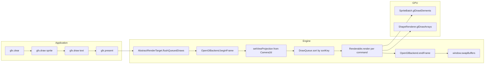
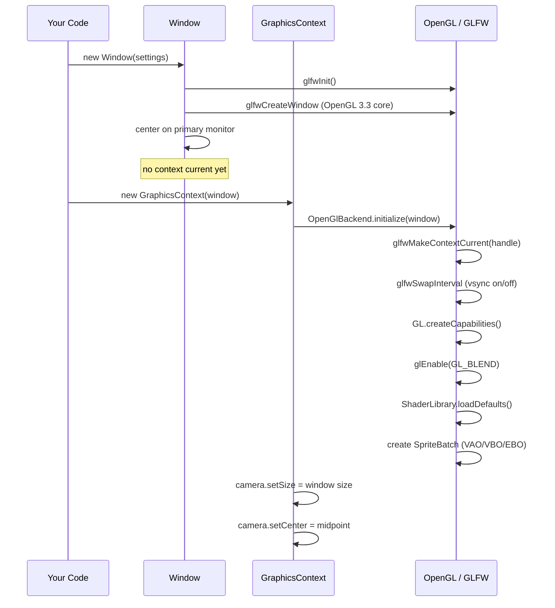
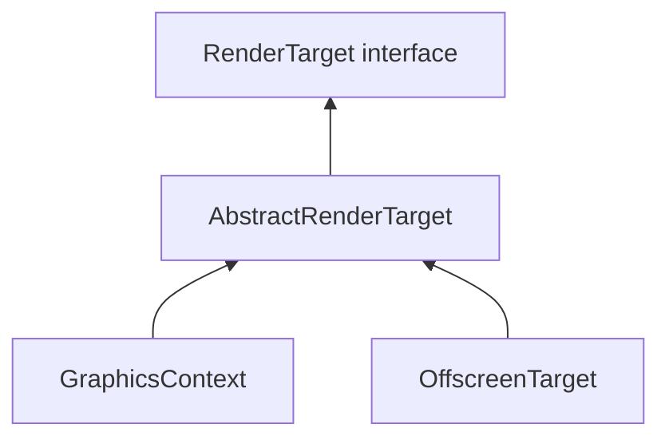
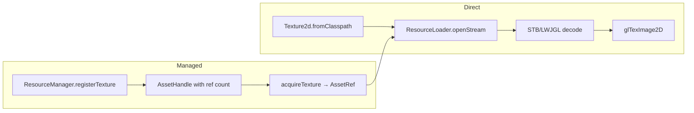

# Engine Architecture

This page explains **how LLW works under the hood** — from `GraphicsContext` creation to the GPU draw call. It covers the GL lifecycle, the draw queue, the OpenGL backend internals, the shader system, camera projection, audio architecture, and the threading model.

> **Prerequisites:** Read [Getting Started](/guide/getting-started) and complete [Tutorial 1 — Your First Window](/tutorials/01-window).

---

## Overview: The Frame Pipeline

Every LLW application follows the same per-frame lifecycle. Here is the complete data flow from Java code to the GPU:



**Three critical rules:**

1. **`draw()` is deferred** — it only enqueues geometry. Nothing reaches the GPU until `present()` (on-screen) or `flush()` (offscreen).
2. **The draw queue sorts** every item by layer, shader, texture, and blend mode to minimise state changes.
3. **The window is just a surface** — rendering happens through `RenderTarget`, not `Window` directly.

---

## 1. GL Lifecycle

### 1.1 Startup



**Key init details (from source):**

- `OpenGlBackend.initialize()` makes the GLFW context current, configures swap interval, creates OpenGL capabilities, enables blending (`GL_SRC_ALPHA`, `GL_ONE_MINUS_SRC_ALPHA`), loads default shaders, and allocates `SpriteBatch`, `ShapeRenderer`, and `TextRenderer`.
- The `ShaderLibrary` compiles three embedded GLSL programs (sprite, shape, text) from `DefaultShaders` string constants — **no external `.glsl` files required**.
- `SpriteBatch` creates a VAO with vertex attribute layout: position (2 floats), texcoord (2 floats), color (4 floats) = **8 floats per vertex**.
- `GraphicsContext` inherits from `AbstractRenderTarget`, which owns both the `OpenGlBackend` reference and the `DrawQueue`.

### 1.2 Per-Frame Tick

```
pollEvents()          → GLFW processes OS messages
clear(Color)          → glClearColor + glClear
draw(renderable, ds)  → DrawQueue.enqueue (no GPU call)
present()             → flush → swapBuffers
```

- `present()` calls `flush()` which calls `flushQueuedDraws(IntSize)` on `AbstractRenderTarget`.
- `flushQueuedDraws` calls `backend.beginFrame(size)` (sets viewport and resets GL state tracker), then `backend.setViewProjection(camera.getViewProjection(size))`, then `drawQueue.flush(backend)`.
- `DrawQueue.flush()` sorts commands by `sortKey()`, then calls `Renderable.render(backend, state)` for each. Finally calls `backend.endFrame()` which flushes the sprite batch.
- After the queue flush, `present()` calls `window.swapBuffers()` (GLFW `glfwSwapBuffers`).

### 1.3 Shutdown

```
graphics.dispose() → active=false → backend.dispose() → window.destroy()
```

- `backend.dispose()` destroys `SpriteBatch` (VAO/VBO/EBO), `ShapeRenderer`, and `ShaderLibrary` (all GL programs).
- `window.destroy()` calls `glfwDestroyWindow` + `glfwTerminate`.

---

## 2. The Draw Queue

**Location:** `org.llw.render.gl.DrawQueue`

The `DrawQueue` is a simple `ArrayList<DrawCommand>` that accumulates renderables until flushed. Each `DrawCommand` bundles a `Renderable` reference, a `DrawState`, and a `submissionOrder` counter.

### 2.1 Sort Order

When flushed, commands are sorted by `DrawState.sortKey(submissionOrder)`:

```java
public long sortKey(int submissionOrder) {
    // Bits: [layer:32] | [submissionOrder:32]
    return ((long) layer << 32) | (long) submissionOrder;
}
```

This ensures:
1. **Layer ascending** — lower layers draw first (behind higher layers).
2. **Submission order ascending** — within the same layer, FIFO order is preserved.

The actual draw call sorting done by `DrawQueue.flush()` passes through `OpenGlBackend`, which sorts further by shader, texture, and blend mode during batching. The queue's primary role is **layer ordering**.

### 2.2 What Happens During Flush

```mermaid
flowchart LR
    A[DrawQueue.flush] --> B[sort by sortKey]
    B --> C[for each DrawCommand]
    C --> D[renderable.render(backend, state)]
    D --> E[backend sets view-projection]
    E --> F[backend calls appropriate renderer]
    F --> G[SpriteBatch or ShapeRenderer]
```

---

## 3. The OpenGL Backend (`OpenGlBackend`)

**Location:** `org.llw.render.gl.OpenGlBackend`

The backend is the engine's central GL facade. It owns:

| Component | Role | Source file |
|-----------|------|-------------|
| `ShaderLibrary` | Registry of compiled GLSL programs (sprite, shape, text defaults) | `ShaderLibrary.java` |
| `GlStateTracker` | Deduplicates GL state changes (program, texture, blend) | `GlStateTracker.java` |
| `SpriteBatch` | Batched textured quad rendering (up to 10,000 quads per batch) | `SpriteBatch.java` |
| `ShapeRenderer` | Immediate-mode untextured vertex rendering | `ShapeRenderer.java` |
| `TextRenderer` | Bitmap font glyph rendering (quads per character) | `TextRenderer.java` |
| `viewProjection` | Cached `Matrix3x2` set before each frame's flush | — |

### 3.1 The Draw Methods

**`drawTexturedQuad()`** — the primary batch renderer:

1. Checks if a batch restart is needed (shader, blend mode, or texture changed).
2. If so, flushes the current batch first, then begins a new one.
3. Appends quad vertices to the `SpriteBatch` float buffer.
4. The batch auto-flushes when it reaches 10,000 quads.

**`drawVertices()`** — immediate untextured geometry:

1. Flushes any pending sprite batch first (preserves draw order).
2. Uploads vertices directly via `ShapeRenderer.draw()`.

**`drawText()`** — text glyph rendering:

1. Flushes any pending sprite batch first.
2. Delegates to `TextRenderer.draw()` which generates a quad per glyph.

### 3.2 View-Projection Matrix

The backend holds a single `viewProjection` `Matrix3x2` that is set each frame by `flushQueuedDraws()` using `Camera2d.getViewProjection()`. Every draw call combines this with the local model matrix:

```java
mvp = viewProjection × model
```

This multiplication happens per-vertex in `SpriteBatch.putVertex()`:

```java
float clipX = m[0] * x + m[4] * y + m[12];
float clipY = m[1] * x + m[5] * y + m[13];
```

Because the matrix is 3×2 (affine), the transform is applied in clip space directly — no separate projection step.

---

## 4. Sprite Batcher Internals

**Location:** `org.llw.render.gl.SpriteBatch`

The `SpriteBatch` is the performance heart of LLW rendering. Here is its internal architecture:

### 4.1 Vertex Layout

| Attribute | Components | Offset | Type |
|-----------|-----------|--------|------|
| Position | 2 (x, y) | 0 bytes | `float` |
| TexCoord | 2 (u, v) | 8 bytes | `float` |
| Color | 4 (r, g, b, a) | 16 bytes | `float` |

**Stride:** 8 floats = 32 bytes per vertex.

### 4.2 GL Resources (created in constructor)

- **VAO** — vertex array object bundling attribute state
- **VBO** — vertex buffer (dynamic draw, `MAX_QUADS × 4 × 8 × 4` bytes = 1,280,000 bytes)
- **EBO** — element index buffer (static, precomputed triangles: `{0,1,2, 2,3,0}` per quad)
- **FloatBuffer** — CPU-side staging buffer for vertex data (direct NIO buffer)

### 4.3 Capacity

- **Maximum quads per batch:** 10,000 (`MAX_QUADS`)
- **Maximum vertices per flush:** 40,000
- **Maximum indices per flush:** 60,000

### 4.4 The Begin/Flush Cycle

```mermaid
flowchart LR
    A[begin(shader, blend, vp)] --> B[active = true]
    B --> C[drawQuad calls...]
    C --> D[compute MVP = vp × model]
    D --> E[clip-space transform per vertex]
    E --> F[put 4 vertices to buffer]
    F --> C
    C --> G[flush(stateTracker)]
    G --> H[useProgram + applyBlend]
    H --> I[bindTexture(0)]
    I --> J[upload buffer sub-data]
    J --> K[set uniforms: mvp=identity, tex, useTex, uTime]
    K --> L[glDrawElements TRIANGLES]
    L --> M[reset: quadCount=0, active=false]
```

**Key optimisation:** The matrix uploaded to the GPU is **always identity** because the transformation is already applied in the CPU-side vertex transform in `putVertex()`. This means the default sprite shader's MVP uniform is a no-op identity matrix.

### 4.5 Batch Break Conditions

A new batch begins (triggering a flush of the current one) when any of these changes:

- **Shader program** changes (`currentShader vs newShader`)
- **Blend mode** changes (`currentBlend vs newBlend`)
- **Texture** changes (`lastBatchTexture.id() vs newTexture.id()`)

Each batch break causes one `glDrawElements` call. Therefore, rendering 500 sprites sharing one texture = 1 draw call, while 500 sprites each on a unique texture = up to 500 draw calls.

---

## 5. Camera and Projection

**Location:** `org.llw.render.graphics.Camera2d`

### 5.1 Coordinate System

- **World space:** Y-down (origin top-left, Y increases downward)
- **Screen space:** Same Y-down, pixels
- **Rotation:** Positive = clockwise (matching Y-down convention)

### 5.2 Camera Properties

| Property | Default | Description |
|----------|---------|-------------|
| `center` | `(0, 0)` | World-space center of the visible region |
| `size` | `(1000, 1000)` | World width and height visible |
| `viewport` | `(0, 0, 1, 1)` | Normalized sub-rectangle on the target |

### 5.3 Orthographic Matrix

The camera produces an orthographic Y-down projection:

```
Matrix3x2.ortho(left, right, top, bottom)

left   = center.x - size.x / 2
right  = center.x + size.x / 2
top    = center.y - size.y / 2    (note: Y-down, so "top" is smaller Y)
bottom = center.y + size.y / 2
```

This matrix maps world coordinates to clip space ([-1, 1] × [-1, 1]) with Y flipped for screen convention.

### 5.4 Zoom

Zoom is controlled through `size`:

- **`size = (1280, 720)`** → world units match pixels (1:1 at default zoom)
- **`size = (640, 360)`** → zoomed in (less world visible, objects appear larger)
- **`size = (2560, 1440)`** → zoomed out (more world visible, objects appear smaller)

### 5.5 Screen ↔ World Conversion

```java
// Mouse position → world coordinates (accounts for zoom, pan, viewport)
Vector2f world = camera.screenToWorld(window.mousePosition(), gfx.getSize());

// World position → pixel coords on screen
Vector2f screen = camera.worldToScreen(worldPoint, gfx.getSize());
```

The conversion math (simplified from source):

```
worldX = center.x - size.x/2  +  (screenX - targetW * viewport.left)
                                   / (targetW * viewport.width) * size.x
```

---

## 6. Shader System

**Location:** `org.llw.render.gl.ShaderLibrary`, `org.llw.render.graphics.ShaderProgram`

### 6.1 Default Shaders

Three built-in GLSL 330 core programs are compiled at startup from embedded strings in `DefaultShaders`:

| Program | Used by | Vertex | Fragment |
|---------|---------|--------|----------|
| Sprite | `Sprite`, `Text`, textured `VertexGeometry` | MVP transform + UV pass-through | Texture sample + color tint |
| Shape | `Rectangle`, `Circle`, untextured `VertexGeometry` | MVP transform | Uniform color fill |
| Text | `Text` (via `TextRenderer`) | MVP + UV | Texture sample (font atlas) + color tint |

The shader sources are compiled at `OpenGlBackend.initialize()` time via `ShaderLibrary.loadDefaults()`. No external files are required.

### 6.2 ShaderProgram Wrapper

`ShaderProgram` wraps a GL program handle (`glCreateProgram`) and provides:

- Uniform location caching (MVP, texture, useTexture, time)
- `fromSources(String vert, String frag)` — compile from string
- `fromClasspath(String vertPath, String fragPath)` — load from classpath files
- `destroy()` — `glDeleteProgram`

Custom shaders must respect the same `Vertex` attribute layout (position at location 0, UV at location 1, color at location 2) or provide a fully custom geometry path.

### 6.3 Uniforms Set Each Frame

When `SpriteBatch.flush()` draws, it sets:

| Uniform | Purpose | Set to |
|---------|---------|--------|
| `mvp` | Model-view-projection matrix | Identity (transform was CPU-baked) |
| `tex` | Texture sampler | Unit 0 |
| `useTexture` | Whether to sample a texture | 0 or 1 |
| `uTime` | Shader time (seconds since GLFW init) | `GLFW.glfwGetTime()` |

---

## 7. Audio Architecture

**Location:** `org.llw.audio.*`

### 7.1 Initialisation

`AudioContext` is the entry point. It must be created on the main thread **after** GLFW can load natives:

```java
// After GLFW is initialized (Window created)
AudioContext audio = new AudioContext();
```

On construction, `AudioContext`:
1. Creates an OpenAL device (`alcOpenDevice`)
2. Creates an OpenAL context (`alcCreateContext`)
3. Makes the context current (`alcMakeContextCurrent`)
4. Creates a pool of OpenAL sources (default: 32)
5. Sets up the listener position/orientation defaults

### 7.2 Sound vs Music

| Type | Loaded | Memory | Update required | Use case |
|------|--------|--------|-----------------|----------|
| `Sound` | Full PCM decode | Entire buffer in memory | `audio.update()` for cleanup only | Short SFX (< 5s) |
| `Music` | Streaming | Small buffer (chunks) | **Every frame** | Background music, long tracks |

### 7.3 Source Pool

OpenAL has a limited number of sources (typically 32). LLW maintains a pool:

- `audio.createSound()` allocates a source from the pool.
- When all sources are in use, attempting to play another sound is a silent no-op (or returns null).
- Implement a [Sound Pool](/cookbook/sound-pool) for games with many simultaneous effects.

### 7.4 The Update Loop

For streaming music, call `audio.update()` every frame:

```java
while (gfx.isActive()) {
    gfx.pollEvents();
    // ... game logic ...
    if (audio != null) audio.update();
    gfx.clear(color);
    gfx.present();
}
```

`audio.update()` refills streaming buffers for active `Music` instances and cleans up stopped `Sound` sources.

### 7.5 Listener

`AudioListener` is a static API (not instance-based):

| Method | Purpose |
|--------|---------|
| `AudioListener.getGlobalVolume()` / `setGlobalVolume(float)` | Master gain (0.0–1.0) |
| `AudioListener.setPosition(float x, float y, float z)` | 3D listener position |
| `AudioListener.setDirection(float x, float y, float z)` | Orientation vector |

3D positions use a separate `org.llw.audio.core.Vector3f` — not the math module's 2D vector.

---

## 8. Render Target Hierarchy



- **`RenderTarget`** — interface: `draw()`, `clear()`, `flush()`, `getCamera()`, `getSize()`
- **`AbstractRenderTarget`** — owns `OpenGlBackend`, `DrawQueue`, `Camera2d`. Implements `flushQueuedDraws()`.
- **`GraphicsContext`** — on-screen target. Adds `present()` (flush + swap buffers), `pollEvents()`, `dispose()`.
- **`OffscreenTarget`** — FBO-backed target. Draws to a framebuffer object; `flush()` renders to the FBO; the color attachment can be read as a `Texture2d`.

### 8.1 OffscreenTarget Internals

`OffscreenTarget` creates an FBO with a color attachment texture. Drawing to it:

1. `beginFrame()` — binds the FBO, sets viewport to FBO size.
2. Draw commands flush to the FBO's color attachment.
3. The color texture can then be used in subsequent `gfx.draw()` calls (e.g., minimap, post-processing).

---

## 9. Resource Loading Chain



### Direct vs Managed

- **Direct loaders** (`Texture2d.fromClasspath()`, `audio.loadSoundBuffer()`) are simplest for demos and tutorials.
- **`ResourceManager`** adds reference-counted lifecycle: register once, acquire/release via `AssetRef<T>`, automatic GPU disposal when ref count reaches zero.

### Classpath vs Filesystem

- Classpath paths are **relative to src/main/resources** with **no leading slash**: `"llw/render/fonts/Roboto-Regular.ttf"`
- Filesystem paths work for external assets: `Path.of("assets/player.png")`

---

## 10. Threading Model

LLW is **single-threaded on the main thread** for all GL and OpenAL operations.

| What | Thread | Why |
|------|--------|-----|
| Window creation | Main thread | GLFW requires this |
| `pollEvents()` | Main thread | GLFW callbacks only fire when polled from the creating thread |
| `draw()` / `present()` | Main thread | OpenGL context is bound to the main thread |
| Audio context | Main thread | OpenAL context is thread-local |
| Asset loading | Main thread | Texture/SoundBuffer creation touches GL/AL |
| Script execution (Studio) | Main thread | GraalJS runs in the frame loop |
| Physics stepping (Studio) | Main thread | Box2D world is stepped during frame tick |

**Consequences:**
- Heavy asset loading blocks the frame — show a loading screen.
- Background thread work (AI, pathfinding) must return results to the main thread for rendering.
- `Music` streaming (disk I/O) happens inside `audio.update()` on the main thread — very fast for OGG at typical bitrates.

---

## 11. Source Map

| Subsystem | Package | Key files |
|-----------|---------|-----------|
| Render target | `org.llw.render.graphics` | `GraphicsContext`, `AbstractRenderTarget`, `RenderTarget` |
| Window | `org.llw.render.window` | `Window`, `WindowSettings` |
| GL backend | `org.llw.render.gl` | `OpenGlBackend`, `SpriteBatch`, `ShapeRenderer`, `TextRenderer`, `DrawQueue`, `GlStateTracker`, `ShaderLibrary` |
| Shaders | `org.llw.render.gl` | `ShaderProgram`, `DefaultShaders`, `ShaderLibrary` |
| Camera | `org.llw.render.graphics` | `Camera2d` |
| Renderables | `org.llw.render.renderables` | `Sprite`, `Rectangle`, `Circle`, `Text`, `VertexGeometry` |
| Input | `org.llw.render.input` | `Input`, `Keyboard`, `Mouse`, `Gamepad` |
| Audio | `org.llw.audio` | `AudioContext`, `Sound`, `SoundBuffer`, `Music` |
| Math | `org.llw.math.*` | `Vector2f`, `Matrix3x2`, `RectF`, `Intersection2`, etc. |
| Resources | `org.llw.resources` | `ResourceManager`, `AssetRef`, `AssetDescriptor` |

---

## 12. Common Architecture Pitfalls

| Mistake | Consequence | Fix |
|---------|-------------|-----|
| Creating `AudioContext` before `Window` | OpenAL init fails (no GLFW natives) | Create audio after window |
| Calling `draw()` without `present()` | Nothing appears on screen | Always end frame with `present()` |
| Per-frame `Texture2d` creation | GPU memory leak, massive GC pressure | Load textures once, reuse |
| Per-frame `Matrix3x2` allocation | GC overhead in hot loop | Reuse scratch matrices |
| Forgetting `audio.update()` with Music | Music plays first buffer then stops | Call `update()` every frame |
| Multi-threaded GL calls | Random crashes, undefined GL state | Keep all GL on main thread |
| Caching `gfx.getSize()` across resize | Wrong dimensions after window resize | Call `gfx.getSize()` each frame |

## See also

- [Render Pipeline Deep Dive](/architecture/render-pipeline)
- [Draw State & Layers](/render/draw-state)
- [Render Overview](/render/overview)
- [Javadoc](/api/javadoc)
