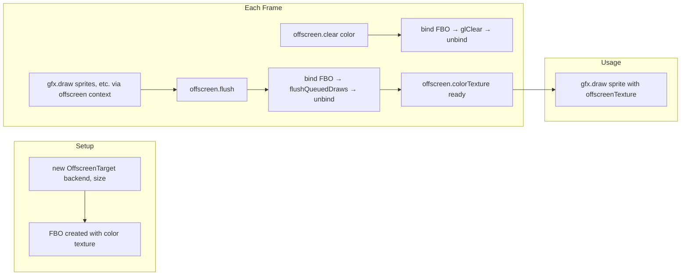

# Render Pipeline Deep Dive

This page traces a single `gfx.draw(sprite)` call all the way to the GPU, explaining every layer in the pipeline. It covers vertex data flow, sprite batch mechanics, draw order guarantees, and offscreen rendering.

> **Prerequisites:** Read [Engine Architecture](/architecture/engine-overview) and [Draw State & Layers](/render/draw-state).

---

## Overview: The Pipeline in One Diagram

```mermaid
flowchart TB
    subgraph "1. Enqueue (frame loop)"
        A[gfx.draw(sprite, DrawState)] --> B[AbstractRenderTarget.draw]
        B --> C[DrawQueue.enqueue(renderable, state)]
    end
    
    subgraph "2. Flush (present() or flush())"
        D[present / flush] --> E[AbstractRenderTarget.flushQueuedDraws]
        E --> F[backend.beginFrame size]
        F --> G[setViewProjection = camera.getViewProjection]
        G --> H[DrawQueue.sort]
    end
    
    subgraph "3. Process Each Command"
        H --> I[Sprite.render backend, state]
        I --> J[resolve model matrix]
        J --> K[backend.drawTexturedQuad]
        K --> L[OpenGlBackend.ensureSpriteBatch]
        L --> M[conditionally flush old batch]
        M --> N[SpriteBatch.begin shader, blend, vp]
        N --> O[SpriteBatch.drawQuad model, xy, uv, color, texture]
    end
    
    subgraph "4. GPU Upload (endFrame or batch break)"
        O --> P[OpenGlBackend.endFrame]
        P --> Q[SpriteBatch.flush]
        Q --> R[useProgram + applyBlend]
        R --> S[bindTexture(0)]
        S --> T[upload buffer sub-data]
        T --> U[set uniforms: mvp=identity, tex, uTime]
        U --> V[glDrawElements TRIANGLES × N quads]
    end
```

---

## 1. The Enqueue Phase

### 1.1 `gfx.draw(sprite)` — The Call

```java
public void draw(Renderable renderable, DrawState state) {
    drawQueue.enqueue(renderable, state);
}
```

**Key insight:** This is **O(1) append** to an `ArrayList<DrawCommand>`. No GPU work, no sorting, no allocation beyond the list growth. The `DrawState` record is stored as-is.

Each `DrawCommand` stores:

| Field | Type | Source |
|-------|------|--------|
| `renderable` | `Renderable` | The sprite/shape/text instance |
| `state` | `DrawState` | Per-draw overrides (layer, blend, shader, texture, transform) |
| `order` | `int` | Monotonic submission counter |

The `Renderable` interface is minimal:

```java
public interface Renderable {
    void render(OpenGlBackend backend, DrawState state);
}
```

### 1.2 DrawCommand Structure

```java
record DrawCommand(Renderable renderable, DrawState state, int order) {
    long sortKey() {
        return state.sortKey(order);  // Layer << 32 | order
    }
}
```

The `sortKey` packs layer and submission order into a single 64-bit `long` for fast sorting via `Comparator.comparingLong()`.

---

## 2. The Flush Phase

When `present()` (on-screen) or `flush()` (offscreen) is called:

### 2.1 `AbstractRenderTarget.flushQueuedDraws()`

```java
protected void flushQueuedDraws(IntSize size) {
    backend.beginFrame(size);       // Step A
    backend.setViewProjection(      // Step B
        camera.getViewProjection(size)
    );
    drawQueue.flush(backend);       // Step C
}
```

#### Step A: `backend.beginFrame(size)`

```java
public void beginFrame(IntSize viewport) {
    GL11.glViewport(0, 0, viewport.width(), viewport.height());
    stateTracker.reset();             // Clear cached GL state
    shaderTimeSeconds = (float) GLFW.glfwGetTime();  // For shader uniforms
}
```

The `GlStateTracker.reset()` clears the cache of last-bound program, texture, and blend mode, so subsequent calls will apply them unconditionally.

#### Step B: `setViewProjection`

The projection matrix from `Camera2d.getViewProjection()` is computed as:

```
left   = camera.center.x - camera.size.x / 2
right  = camera.center.x + camera.size.x / 2
top    = camera.center.y - camera.size.y / 2
bottom = camera.center.y + camera.size.y / 2

Matrix3x2.ortho(left, right, top, bottom)
```

This becomes the `viewProjection` matrix that every draw call's model matrix is multiplied against.

### 2.2 Draw Queue Sorting

```java
public void flush(OpenGlBackend backend) {
    commands.sort(Comparator.comparingLong(DrawCommand::sortKey));
    for (DrawCommand command : commands) {
        command.renderable().render(backend, command.state());
    }
    backend.endFrame();
    commands.clear();
    submissionOrder = 0;
}
```

**Sort priority:**
1. **Layer (ascending)** — 32-bit integer, most significant
2. **Submission order (ascending)** — 32-bit integer, tiebreaker

Commands within the same layer execute in FIFO order. The sort is stable only in the submission-order tiebreaker.

### 2.3 `backend.endFrame()`

```java
public void endFrame() {
    flushSprites();        // Submit any remaining batched quads
    lastBatchTexture = null;
}
```

This ensures the final partial batch is submitted.

---

## 3. Sprite Rendering — Full Trace

### 3.1 `Sprite.render(backend, state)`

When the draw queue processes a `Sprite` command, this is called:

```java
// Simplified from Sprite.render():
public void render(OpenGlBackend backend, DrawState state) {
    Matrix3x2 matrix = combineTransforms(state);  // state.transform × this.transform
    Texture2d tex = (state.texture() != null) ? state.texture() : this.texture;
    
    backend.drawTexturedQuad(
        matrix,
        left, top, right, bottom,    // Local quad corners
        u0, v0, u1, v1,             // UV coordinates
        tint,                        // Color
        tex,                         // Texture
        state.shader(),              // Shader override (null = default)
        state.blendMode()            // Blend override
    );
}
```

The `combineTransforms` method resolves the final transform:

```java
transform = state.transform() × this.getTransform()
```

Where `state.transform()` is the parent transform from `DrawState` and `this.getTransform()` is the sprite's local transform (position, rotation, scale, origin).

### 3.2 The Texture Resolve

The effective texture is resolved as:
- **DrawState texture override** (if non-null) — for shared geometry with swapped textures
- **Sprite's own texture** (if DrawState.texture is null)

If both are null, the sprite renders with no texture (the shader handles `useTexture=0`).

### 3.3 `OpenGlBackend.drawTexturedQuad()` — The Batch Decision

```java
public void drawTexturedQuad(
    Matrix3x2 model,
    float x0, float y0, float x1, float y1,
    float u0, float v0, float u1, float v1,
    Color color, Texture2d texture,
    ShaderProgram shader, BlendMode blendMode
) {
    ShaderProgram activeShader = (shader != null) ? shader : shaderLibrary.spriteShader();
    ensureSpriteBatch(activeShader, blendMode, texture);
    spriteBatch.drawQuad(model, x0, y0, x1, y1, u0, v0, u1, v1, color, texture);
}
```

The critical function is `ensureSpriteBatch`:

```java
private void ensureSpriteBatch(ShaderProgram shader, BlendMode blendMode, Texture2d texture) {
    boolean textureChanged = texture != null
            && lastBatchTexture != null
            && lastBatchTexture.id() != texture.id();
    boolean needsRestart = !spriteBatch.isActive()
            || spriteBatch.currentShader() != shader
            || spriteBatch.currentBlend() != blendMode
            || textureChanged;

    if (needsRestart) {
        flushSprites();                                 // Submit current batch
        spriteBatch.begin(shader, blendMode, viewProjection);
        lastBatchTexture = texture;
    }
}
```

**A new batch begins (and the current one flushes) when any of these change:**
1. Shader program reference changes
2. Blend mode enum changes
3. Texture object ID changes
4. The batch was not active (first draw of the frame)

---

## 4. The GPU Vertex Transform

### 4.1 `SpriteBatch.drawQuad()` — CPU-Side Transform

```java
public void drawQuad(Matrix3x2 model, ..., Texture2d texture) {
    Matrix3x2 mvp = viewProjection.copy();
    if (model != null) {
        mvp.multiply(model);
    }
    putVertex(mvp, x0, y0, u0, v0, color);
    putVertex(mvp, x1, y0, u1, v0, color);
    putVertex(mvp, x1, y1, u1, v1, color);
    putVertex(mvp, x0, y1, u0, v1, color);
    currentTexture = texture;
    quadCount++;
}
```

The `putVertex` method applies the MVP matrix to each vertex:

```java
private void putVertex(Matrix3x2 mvp, float x, float y, float u, float v, Color color) {
    float[] m = mvp.elements();     // 4×4 matrix stored as float[16]
    float clipX = m[0] * x + m[4] * y + m[12];
    float clipY = m[1] * x + m[5] * y + m[13];
    float clipW = m[3] * x + m[7] * y + m[15];
    if (clipW != 0f && clipW != 1f) {
        clipX /= clipW;
        clipY /= clipW;
    }
    vertices.put(clipX).put(clipY).put(u).put(v)
            .put(color.rNorm()).put(color.gNorm())
            .put(color.bNorm()).put(color.aNorm());
}
```

**Important: The matrix is stored in column-major order.** The multiplication uses the 3×2 affine elements (rows 0-1, columns 0-3) with homogeneous coordinate W from row 2.

The vertex buffer accumulates:

```
[clipX, clipY, U, V, r, g, b, a] per vertex
```

### 4.2 Batch Capacity

- **Max quads per batch:** 10,000
- **Buffer size:** 10,000 × 4 × 8 × 4 bytes = 1,280,000 bytes (1.28 MB)
- **Index array:** 10,000 × 6 = 60,000 ints, precomputed at construction

If `drawQuad` is called after capacity is reached, an `IllegalStateException` is thrown. In practice, the batch should auto-flush before this, but the guard exists for safety.

### 4.3 Index Buffer (Precomputed)

The index buffer defines two triangles per quad:

```
Triangle 0: {v0, v1, v2}
Triangle 1: {v2, v3, v0}
```

Indices are precomputed at `SpriteBatch` construction time for all 10,000 quads and uploaded as a static buffer.

---

## 5. The GPU Draw Call

### 5.1 `SpriteBatch.flush()` — The Submit

```java
public void flush(GlStateTracker stateTracker) {
    if (quadCount == 0 || currentShader == null) {
        // Early exit: nothing to draw
        reset();
        return;
    }

    stateTracker.useProgram(currentShader);      // glUseProgram
    stateTracker.applyBlendMode(currentBlend);   // glBlendFunc

    if (currentTexture != null) {
        currentTexture.bind(0);                  // glActiveTexture + glBindTexture
        stateTracker.bindTexture(currentTexture.id());
    }

    GL15.glBindBuffer(GL15.GL_ARRAY_BUFFER, vbo);
    vertices.flip();
    GL15.glBufferSubData(GL15.GL_ARRAY_BUFFER, 0, vertices);

    // Upload identity as MVP (transform was CPU-baked)
    Matrix3x2 identity = new Matrix3x2().identity();
    identity.upload(currentShader.mvpLocation());

    // Set texture sampler and flags
    if (currentShader.textureLocation() >= 0)
        GL20.glUniform1i(currentShader.textureLocation(), 0);
    if (currentShader.useTextureLocation() >= 0)
        GL20.glUniform1i(currentShader.useTextureLocation(), currentTexture == null ? 0 : 1);

    // Set shader time
    currentShader.setUniform1f(currentShader.timeLocation(), shaderTimeSeconds);

    GL30.glBindVertexArray(vao);
    GL11.glDrawElements(GL11.GL_TRIANGLES, quadCount * 6, GL11.GL_UNSIGNED_INT, 0);
    GL30.glBindVertexArray(0);

    reset();  // quadCount=0, active=false, texture=null
}
```

### 5.2 What the GPU Sees

1. **Vertex buffer** — clip-space positions already transformed, with UV coordinates and per-vertex colors
2. **Index buffer** — precomputed triangle pairs
3. **MVP uniform** — identity (the GPU doesn't need to transform further)
4. **Texture** — bound at unit 0
5. **Uniforms** — `tex=0`, `useTexture=1` (or 0), `uTime` = elapsed seconds

### 5.3 `glDrawElements` Parameters

| Parameter | Value |
|-----------|-------|
| Mode | `GL_TRIANGLES` |
| Count | `quadCount × 6` indices |
| Type | `GL_UNSIGNED_INT` |
| Indices | 0 (bound EBO) |

One draw call renders `quadCount` quads (2 triangles each, 6 indices per quad).

---

## 6. Shape Rendering (Immediate Mode)

### 6.1 Path Taken

When the draw queue encounters a `Rectangle`, `Circle`, or untextured `VertexGeometry`:

1. `AbstractRenderTarget.draw()` calls `renderable.render(backend, state)`
2. The renderable calls `backend.drawVertices(model, vertices, primitiveType, shader, blendMode)`
3. `drawVertices()` flushes the sprite batch first (maintaining draw order)
4. `ShapeRenderer.draw()` uploads vertices and issues `glDrawArrays`

### 6.2 `ShapeRenderer.draw()`

```java
public void draw(GlStateTracker stateTracker, ShaderProgram shader,
                 BlendMode blendMode, Matrix3x2 mvp, Vertex[] vertices,
                 PrimitiveType primitiveType) {
    stateTracker.useProgram(shader);
    stateTracker.applyBlendMode(blendMode);

    // Allocate temp buffer and upload
    FloatBuffer buffer = BufferUtils.createFloatBuffer(vertices.length * 8);
    for (Vertex vertex : vertices) {
        buffer.put(vertex.position.x).put(vertex.position.y)
              .put(vertex.texCoord.x).put(vertex.texCoord.y)
              .put(vertex.color.rNorm()).put(vertex.color.gNorm())
              .put(vertex.color.bNorm()).put(vertex.color.aNorm());
    }
    buffer.flip();

    GL15.glBindBuffer(GL15.GL_ARRAY_BUFFER, vbo);
    GL15.glBufferData(GL15.GL_ARRAY_BUFFER, buffer, GL15.GL_STREAM_DRAW);
    mvp.upload(shader.mvpLocation());

    GL30.glBindVertexArray(vao);
    GL11.glDrawArrays(toGlPrimitive(primitiveType), 0, vertices.length);
    GL30.glBindVertexArray(0);
}
```

**Key difference from SpriteBatch:** ShapeRenderer allocates a **new** FloatBuffer every draw. This is by design — shapes are typically few per frame (UI panels, debug overlays) where allocation cost is negligible. For performance-sensitive shape-heavy scenes, prefer sprites with procedural textures.

### 6.3 Primitive Type Mapping

| LLW enum | GL enum |
|----------|---------|
| `POINTS` | `GL_POINTS` |
| `LINES` | `GL_LINES` |
| `LINE_STRIP` | `GL_LINE_STRIP` |
| `TRIANGLES` | `GL_TRIANGLES` |
| `TRIANGLE_FAN` | `GL_TRIANGLE_FAN` |
| `TRIANGLE_STRIP` | `GL_TRIANGLE_STRIP` |

---

## 7. Text Rendering

### 7.1 Path Taken

1. Draw queue processes a `Text` renderable
2. `Text.render()` calls `backend.drawText(model, font, string, x, y, color, shader, blend)`
3. `drawText()` flushes the sprite batch (maintaining draw order between text and previous sprites)
4. `TextRenderer` iterates characters, looking up glyph metrics from `Font`

### 7.2 Glyph Layout

```java
for (int i = 0; i < text.length(); i++) {
    char character = text.charAt(i);
    if (character == '\n') {
        cursorX = x;
        cursorY += font.lineHeight();
        continue;
    }
    Glyph glyph = font.glyph(character);
    if (glyph == null) continue;

    // Each glyph = one textured quad submitted via backend
    backend.drawTexturedQuad(
        model,
        cursorX + glyph.bearingX,
        cursorY + glyph.bearingY,
        cursorX + glyph.bearingX + glyph.width,
        cursorY + glyph.bearingY + glyph.height,
        glyph.u0, glyph.v0, glyph.u1, glyph.v1,
        color,
        font.texture(),   // Font atlas texture
        textShader,       // Text-specific shader or override
        blendMode
    );

    cursorX += glyph.advance;
}
```

**Each glyph is an individual textured quad** submitted through the sprite batch. Multiple glyphs on the same line with the same shader/blend/texture will batch together. After all glyphs are enqueued, `TextRenderer` calls `backend.flushSprites()` to submit the batch.

### 7.3 Font Atlas

`Font` holds a single `Texture2d` (the atlas containing all glyph bitmaps) and a map of character → `Glyph` with UV coordinates and metrics. The atlas is populated by FreeType rasterization at `Font.fromClasspath()` time.

---

## 8. Offscreen Rendering Pipeline

### 8.1 The `OffscreenTarget` Path



### 8.2 `OffscreenTarget.flush()`

```java
public void flush() {
    framebuffer.bind();
    flushQueuedDraws(framebuffer.size());
    framebuffer.unbind();
}
```

The `flushQueuedDraws` is the same method used by `GraphicsContext`, but with the FBO bound as the draw target. `beginFrame()` sets the viewport to the FBO size, and all draw commands render into the FBO's color attachment.

### 8.3 Using the Result

```java
OffscreenTarget minimap = new OffscreenTarget(gfx.backend(), new IntSize(256, 256));

// Each frame: render to offscreen
minimap.clear(new Color(0, 0, 0, 0));
minimap.draw(terrain);
minimap.flush();

// Then use the result on the main screen
Sprite mapSprite = new Sprite(minimap.colorTexture());
mapSprite.setPosition(10, 10);
gfx.draw(mapSprite);
```

### 8.4 Performance Considerations

- Each offscreen `flush()` = one full draw pass (beginFrame → set viewport → sort & execute → endFrame).
- The FBO's color attachment is a GL texture — sampling it in a subsequent draw costs a texture bind but no CPU readback.
- Avoid creating `OffscreenTarget` per-frame; create once and reuse.
- The FBO has no depth/stencil attachment by default.

---

## 9. Full Frame Trace (Debug Mode)

Here's what happens during a single frame with a Sprite, a Rectangle, and Text:

| Step | Code | GPU action |
|------|------|------------|
| 1 | `gfx.clear(color)` | `glClearColor` + `glClear` |
| 2 | `gfx.draw(sprite, DEFAULT)` | Enqueue `DrawCommand` |
| 3 | `gfx.draw(rect, DEFAULT.withLayer(5))` | Enqueue `DrawCommand` |
| 4 | `gfx.draw(text, DEFAULT.withLayer(10))` | Enqueue `DrawCommand` |
| 5 | `gfx.present()` | Trigger flush |
| 6 | `beginFrame(windowSize)` | `glViewport`, reset state tracker |
| 7 | `setViewProjection(camera matrix)` | Cache on backend |
| 8 | **Sort queue** | Compare by layer: sprite(0) < rect(5) < text(10) |
| 9 | `sprite.render(backend, state)` | |
| 10 | → `drawTexturedQuad()` | Batch begins (sprite shader, ALPHA, sprite texture) |
| 11 | `rect.render(backend, state)` | |
| 12 | → `drawVertices()` | **Batch breaks** (different shader). `flushSprites` → **ONE** `glDrawElements` |
| 13 | → `ShapeRenderer.draw()` | **ONE** `glDrawArrays` for rect |
| 14 | `text.render(backend, state)` | |
| 15 | → `drawText()` | Flush sprites. TextRenderer iterates chars. Each glyph → `drawTexturedQuad` |
| 16 | `endFrame()` | `flushSprites` → **ONE** `glDrawElements` for text batch |
| 17 | `swapBuffers()` | `glfwSwapBuffers` |

**Total for this frame:** 2 × `glDrawElements` (sprite batch + text batch) + 1 × `glDrawArrays` (rectangle) = **3 draw calls**.

---

## 10. Performance: Batch Break Analysis

Every batch break adds one draw call. Here's what causes them:

| Condition | Impact | How to avoid |
|-----------|--------|-------------|
| Texture change | Batch break | Use texture atlases |
| Shader change | Batch break | Minimise custom shader switching |
| Blend mode change | Batch break | Group alpha-blended sprites together |
| Draw order interleaving | Batch break | Sort draw calls by texture |
| Shapes between sprites | Batch break (2×) | Draw all shapes before or after sprites |
| Text between sprites | Batch break (2×) | Draw all text in one block |
| Null texture | No break, but `useTexture=0` | Always set a texture |

### Measuring Batch Efficiency

```java
// Enable frame diagnostics
// Monitor FrameDiagnostics counters (if exposed in your build)
// Ideal: 1 batch (single texture) for as many sprites as possible
```

## See also

- [Engine Architecture](/architecture/engine-overview)
- [Draw State & Layers](/render/draw-state)
- [Sprite](/render/sprite)
- [Vertex Geometry](/render/vertex-geometry)
- [Offscreen Rendering](/render/offscreen)
- [Shaders](/render/shaders)
- [Performance Best Practices](/best-practices/performance)
