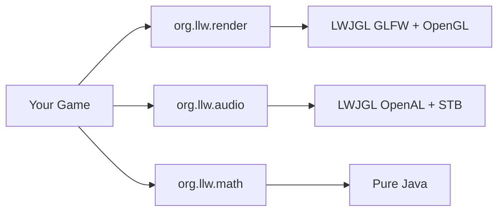

## Documentation map

| Section | What's inside |
|---------|----------------|
| [Studio](/studio/) | LLW Studio editor — panels, assets, scripting, tilemaps, physics, play mode |
| [Tutorials](/tutorials/01-window) | 10-chapter SFML-style learning path from first window to game loop |
| [Render](/render/overview) | Per-type API reference — window, sprites, camera, shaders, … |
| [Cookbook](/cookbook/mouse-picking) | 17 task recipes with nested variations |
| [Best Practices](/best-practices/resource-lifecycle) | Lifecycle, performance, coordinates, IDE setup |
| [FAQ](/faq) | Troubleshooting black screens, audio, natives, zoom mouse |
| [SFML Migration](/sfml-migration) | C++ SFML → Java LLW type mapping |

## Architecture



## Quick start

```java
import org.llw.render.graphics.GraphicsContext;
import org.llw.render.window.Window;
import org.llw.render.window.WindowSettings;
import org.llw.render.core.Color;

Window window = new Window(new WindowSettings().title("Hello LLW").size(800, 600));
GraphicsContext gfx = new GraphicsContext(window);

while (gfx.isActive()) {
    gfx.pollEvents();
    gfx.clear(new Color(30, 30, 40));
    gfx.present();
}
gfx.dispose();
```

Continue with [Tutorial 1 — Your First Window](/tutorials/01-window) or [Getting Started](/guide/getting-started).
