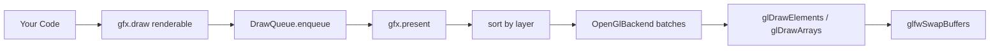

# Render Overview

`org.llw.render` is an SFML-inspired 2D rendering stack on OpenGL 3.3 core. It provides window management, input handling, a batched sprite/shape/text renderer, offscreen framebuffers, and a camera system — all with a single-threaded, deferred-draw model.

## Package Tree

```
org.llw.render/
├── core/              Color, Clock, IntSize — non-spatial utilities
├── window/            Window, WindowSettings, Key, WindowEvent — GLFW window + input
├── graphics/          GraphicsContext, Camera2d, Texture2d, Font, ShaderProgram
│   ├── RenderTarget   (interface)
│   ├── AbstractRenderTarget
│   ├── OffscreenTarget
│   └── system/        SystemFontResolver, SystemFonts (platform font discovery)
├── renderables/       Sprite, Rectangle, Circle, Text, VertexGeometry
├── gl/                OpenGlBackend, SpriteBatch, ShapeRenderer, TextRenderer,
│                     DrawQueue, GlStateTracker, ShaderLibrary, FramebufferObject
├── input/             Input, Keyboard, Mouse, Gamepads, Gamepad
└── resources/         ResourceLoader — classpath I/O for assets
```

Spatial math types (`Vector2f`, `Matrix3x2`, `RectF`) live in [`org.llw.math`](/math/overview).

## How the Pipeline Works (In Brief)



1. **`draw()`** — appends a `Renderable` + `DrawState` to the draw queue (O(1), no GPU work).
2. **`present()`** — flushes the queue: sort by layer, then execute each renderable through `OpenGlBackend`.
3. **Batching** — `SpriteBatch` accumulates textured quads; a new batch begins when shader, blend mode, or texture changes.
4. **GPU** — each batch = one `glDrawElements` call. Shapes use immediate `glDrawArrays`.

> For the full trace of a single draw call through every layer, see [Render Pipeline Deep Dive](/architecture/render-pipeline).

## Draw Queue

`draw()` calls are **queued** and sorted by layer, then submission order, shader, texture, and blend mode. The GPU is touched only when you `present()` (on-screen) or `flush()` (offscreen).

The sort key is a single 64-bit integer:

```java
sortKey = ((long) layer << 32) | submissionOrder
```

This ensures lower layers draw first (behind) and within the same layer, FIFO order is preserved.

## Default Camera

`GraphicsContext` creates a `Camera2d` initialised to the window size:

```java
camera.setSize(window.settings().width(), window.settings().height());
camera.setCenter(window.settings().width() / 2f, window.settings().height() / 2f);
```

This gives 1:1 pixel mapping by default. Change `camera.setSize()` to zoom; change `camera.setCenter()` to pan.

## Minimal draw loop

| Topic | Page |
|-------|------|
| Package map & draw loop | [Overview](/render/overview) (this page) |
| Window & input | [Window](/render/window) |
| Window builder | [WindowSettings](/render/window-settings) |
| Event types | [Events](/render/events) |
| Keys & polling | [Input](/render/input) |
| On-screen target | [Graphics Context](/render/graphics-context) |
| Target interface | [Render Target](/render/render-target) |
| Per-draw state | [Draw State](/render/draw-state) |
| Camera | [Camera](/render/camera) |
| Offscreen FBO | [Offscreen Rendering](/render/offscreen) |
| Drawable types hub | [Renderables](/render/renderables) |
| Sprites | [Sprite](/render/sprite) |
| Rectangles | [Rectangle](/render/rectangle) |
| Circles | [Circle](/render/circle) |
| Custom vertices | [Vertex Geometry](/render/vertex-geometry) |
| Transforms | [Transformable](/render/transformable) |
| Text & fonts | [Text & Fonts](/render/text-and-fonts) |
| Textures | [Textures](/render/textures) |
| Colors | [Color](/render/color) |
| Frame timing | [Clock](/render/clock) |
| Classpath assets | [Resource Loading](/render/resource-loading) |
| Shaders | [Shaders](/render/shaders) |

## Subpackages

| Package | Key types | Role |
|---------|-----------|------|
| `org.llw.render.core` | `Color`, `Clock`, `IntSize` | Non-spatial utilities |
| `org.llw.render.window` | `Window`, `WindowSettings`, `Key` | GLFW window and input |
| `org.llw.render.graphics` | `GraphicsContext`, `Camera2d`, `Texture2d`, `Font` | Drawing and resources |
| `org.llw.render.renderables` | `Sprite`, `Rectangle`, `Circle`, `Text` | Drawable game objects |
| `org.llw.render.gl` | `OpenGlBackend`, `DrawQueue` | Internal GL layer (advanced) |
| `org.llw.render.resources` | `ResourceLoader` | Classpath I/O |

Spatial math types (`Vector2f`, `Matrix3x2`, `RectF`) live in [`org.llw.math`](/math/overview).

## Minimal draw loop

```java
import org.llw.render.core.Color;
import org.llw.render.graphics.GraphicsContext;
import org.llw.render.graphics.TextureFactory;
import org.llw.render.renderables.Sprite;

GraphicsContext gfx = new GraphicsContext(window);

Sprite sprite = new Sprite(TextureFactory.checkerboard(128, 128, 16));
sprite.setPosition(100f, 80f);

while (gfx.isActive()) {
    gfx.pollEvents();
    gfx.clear(new Color(18, 20, 28));
    gfx.draw(sprite);
    gfx.present();
}
```

## Common pitfalls

- Drawable transforms use `setPosition`, `setRotation`, `setScale`, `setOrigin` — see [Transformable](/render/transformable).
- Text requires a loaded `Font`; guard against load failures before drawing.
- Mouse and window events are in **screen pixels** — convert with [Camera](/render/camera) for world-space placement.

## See also

- [Window](/render/window)
- [Graphics Context](/render/graphics-context)
- [Camera](/render/camera)
