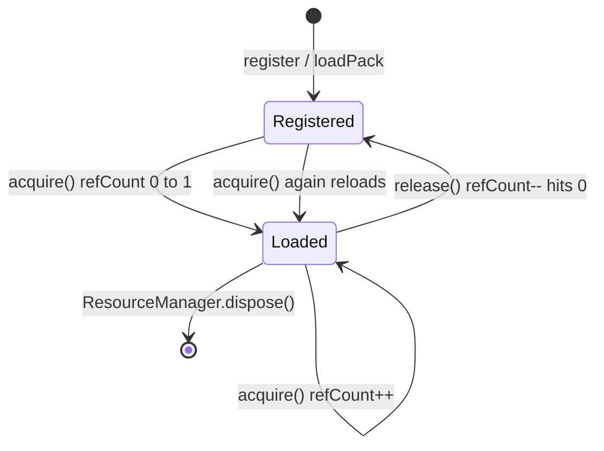

# Asset Lifecycle

Reference counting governs when GPU textures, font atlases, and OpenAL buffers are resident.

## States



| State | `isLoaded` | Native object |
|-------|------------|---------------|
| Registered | `false` | None (descriptor only) |
| Loaded | `true` | `Texture2d`, `Font`, `SoundBuffer`, or `byte[]` |

## Rules for game code

1. Keep an `AssetRef` alive **at least as long** as any `Sprite`, `Text`, or `Sound` using its object.
2. Level unload — drop level `AssetRef`s (or `unpin` batch); memory frees when ref count hits zero.
3. Never call `dispose()` on objects obtained through `acquire*` — release the ref instead.
4. `dispose()` on the manager force-clears everything regardless of ref count.

## Pinning vs acquire

| API | Use when |
|-----|----------|
| `acquire*` + `AssetRef` | Scoped ownership (try-with-resources, per-entity handles) |
| `pin` / `loadAll` | Boot warmup, always-resident UI atlas |
| `unpin` / `unloadAll` | Tear down warmup pins |

Pinning increments the same ref count as `acquire`, but does not return an `AssetRef`.

## Music exception

Music bytes are not fully loaded into RAM. `openMusic(id)` creates a caller-owned `Music` stream tracked by `AudioContext.update()`. Stop music before disposing the manager or the underlying pack file.

## Level transition pattern

```java
// Level load
levelRefs.add(resources.acquireTexture("level.tileset"));
levelRefs.add(resources.acquireSound("level.ambient"));

// Level unload
for (AssetRef<?> ref : levelRefs) {
    ref.release();
}
levelRefs.clear();
```

## See also

- [Resource Manager](/resources/resource-manager)
- [Best Practices: Resource Lifecycle](/best-practices/resource-lifecycle)
