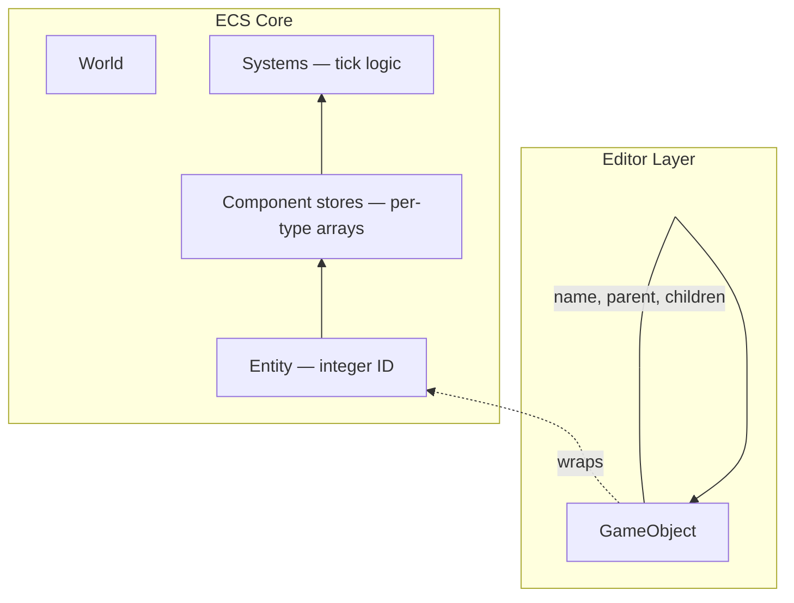

# ECS and GameObjects

LLW Studio uses a **hybrid** model: a Unity-like `GameObject` hierarchy for editing, backed by an ECS `World` of entities, components, and systems at runtime. This page covers the full architecture: the World + Entity model, the GameObject façade, system scheduling, transform propagation, active state, and stable scene IDs.

> **Prerequisites:** [llw engine integration](/studio/llw-engine-integration)

---

## 1. The Hybrid Model



| Layer | Type | Purpose |
|-------|------|---------|
| **World** | `World` class | Stores all entities, per-type component stores, and system scheduler |
| **Entity** | `EntityId` (int index + int generation) | Sparse set identity with generation-based invalidation |
| **Component** | POJO data class | Pure data attached to entities (Transform, SpriteRenderer, etc.) |
| **System** | `EcsSystem` interface | Logic that reads/writes components each frame |
| **GameObject** | `GameObject` class | Editor façade: name, parent/children, convenience accessors, undo metadata |

---

## 2. World and Entities

### 2.1 World

The `World` is the root ECS container. It owns:

```java
public final class World {
    private final List<EntityId> entities;           // Sparse entity list
    private final Map<Class<?>, ComponentStore<?>> stores;  // Per-type arrays
    private final List<EcsSystem> systems;           // Ordered system list
    // ...
}
```

Component storage uses **sparse sets** for cache-friendly iteration:

```
Entity indices: [0, 1, 2, 3, 4, 5, ...]
Component data: [e0.transform, e1.transform, e2.transform, ...]
                   ↑ index maps directly to array position
```

This means iterating all entities with a `Transform2DComponent` is a contiguous array scan — no hash lookups per entity.

### 2.2 Entity ID (`EntityId`)

```java
public record EntityId(int index, int generation) { }
```

- **`index`** — position in the sparse entity array
- **`generation`** — incremented each time the slot is reused (prevents dangling references)

When an entity is destroyed, its slot's generation increments, making all existing `EntityId` instances with the old generation invalid. `World.isAlive(entityId)` checks both index bounds and generation match.

### 2.3 Component Stores

Each component type gets its own dense array:

```java
var transforms = world.store(Transform2DComponent.class);
for (int i = 0; i < transforms.size(); i++) {
    EntityId entity = transforms.entityAt(i);
    Transform2DComponent t = transforms.componentAt(i);
    // process t.position, t.rotation, t.scale
}
```

Components are POJOs — plain data with no methods:

```java
public class Transform2DComponent {
    public float x, y;
    public float rotation;  // degrees
    public float scaleX = 1f, scaleY = 1f;
}
```

---

## 3. The GameObject Façade

### 3.1 Purpose

`GameObject` wraps an `EntityId` for the editor layer. It is **not** stored in the World — it's a transient view constructed on demand from an entity's components.

```java
public final class GameObject {
    private final World world;
    private final EntityId entity;
    
    public String name()      { return world.getComponent(entity, NameComponent.class).name(); }
    public int sceneId()      { return world.getComponent(entity, SceneObjectIdComponent.class).id(); }
    public GameObject parent(){ /* lookup HierarchyComponent → find parent entity → wrap */ }
    public List<GameObject> children() { /* walk HierarchyComponent children → wrap each */ }
}
```

GameObject is how the **Hierarchy** panel, **Inspector** panel, and **Scene view** interact with the ECS world. It provides:

- `name`, `tag`, `active` — editor metadata
- `parent`, `children` — hierarchy traversal
- `transform` — local transform shortcut
- `hasComponent/getComponent/addComponent/removeComponent` — ECS access
- `worldX()`, `worldY()` — cached world position after `TransformSystem` runs

### 3.2 When to Use What

| You need… | Use… |
|-----------|------|
| Edit an entity in the editor | `GameObject` (via selection or Hierarchy) |
| Access raw ECS data in a system | `World.store(ComponentType.class)` |
| Serialize a scene to JSON | `GameObject` → `SceneObjectSerializer` |
| Find an entity in play mode from script | `Entity` (TypeScript SDK, not Java `EntityId`) |

---

## 4. Hierarchy

### 4.1 HierarchyComponent

Parent/child relationships are stored as a component on each child entity:

```java
public class HierarchyComponent {
    public int parentIndex = -1;
    public int parentGeneration = -1;
    public List<EntityId> children = new ArrayList<>();
}
```

When an entity is reparented in the Hierarchy panel:
1. Old parent's `children` list is updated
2. New parent's `children` list is updated
3. Child's `parentIndex`/`parentGeneration` is set
4. A `TransformEditCommand` records the change for undo

### 4.2 Active State Propagation

```java
public class ActiveComponent {
    public boolean active = true;
}
```

`ActiveUtility` determines effective active state by walking the hierarchy:

```
isEffectivelyActive(entity) =
    entity.active && (parent == null || isEffectivelyActive(parent))
```

Inactive entities and their children skip:
- `JsScriptSystem` update/dispatch
- `AnimationSystem` sampling
- `PhysicsSystem` collision (bodies are set to static)
- Rendering (sprites are not drawn)

---

## 5. System Scheduling

### 5.1 SystemGroup

Systems are grouped into `SystemGroup` enums:

| Group | When it runs | Contains |
|-------|-------------|----------|
| `LOGIC` | Each play frame | Input, scripts, animation, transforms, physics, audio |
| `RENDER` | Each frame | Editor draw passes (not ECS — direct rendering) |

### 5.2 System Interface

```java
public interface EcsSystem {
    default void init(World world) {}
    void update(float deltaTime);
    default void dispose() {}
}
```

### 5.3 Registration Order (Play Mode)

Registered in `PlayModeRunner.activate()`, executed in order each frame:

1. **`PlayInputSystem`** — GLFW input → script `Input` namespace
2. **`UiInputSystem`** — Widget hit-test and focus management
3. **`JsScriptSystem`** — `start()` / `update()` / `fixedUpdate()` / collision dispatch
4. **`AnimationSystem`** — Clip keyframe sampling → sprite rect / transform
5. **`TransformSystem`** — World matrix propagation
6. **`PhysicsSystem`** — Box2D fixed-step, transform sync
7. **`AudioSystem`** — Play/stop queued audio sources

### 5.4 Dependency Chain

```
Input → Scripts (read Input, modify transforms)
     → Animation (modify sprite rects)
          → Transforms (propagate local → world)
               → Physics (read transforms, step, write transforms)
                    → Audio (read AudioSource state, play/stop)
```

---

## 6. Transform System

### 6.1 World Matrix Propagation

`TransformSystem` runs after scripts and animation modify local transforms. It walks the hierarchy from root entities (entities with no parent):

```java
public void update(World world) {
    var transforms = world.store(Transform2DComponent.class);
    var hierarchy = world.store(HierarchyComponent.class);
    
    for (int i = 0; i < transforms.size(); i++) {
        EntityId entity = transforms.entityAt(i);
        if (hasNoParent(entity, hierarchy)) {
            propagate(entity, Matrix3x2.identity());
        }
    }
}

private void propagate(EntityId entity, Matrix3x2 parentWorld) {
    var t = world.getComponent(entity, Transform2DComponent.class);
    Matrix3x2 localMatrix = buildLocalMatrix(t);  // position × rotation × scale
    Matrix3x2 worldMatrix = parentWorld × localMatrix;
    
    cacheWorldPosition(entity, worldMatrix);  // worldX, worldY
    
    var h = world.getComponent(entity, HierarchyComponent.class);
    if (h != null) {
        for (EntityId child : h.children) {
            propagate(child, worldMatrix);
        }
    }
}
```

### 6.2 Transform Order

The local transform matrix is built as:

```
localMatrix = translate(position) × rotate(rotation) × scale(scaleX, scaleY)
```

Origin is applied before position/rotation/scale (SFML convention).

---

## 7. SceneObjectIdComponent

### 7.1 Purpose

Each serialized object in a scene needs a stable identifier that survives save/load, play-mode cloning, and scene merging.

```java
public class SceneObjectIdComponent {
    public int id = -1;
}
```

### 7.2 How IDs Are Assigned

1. When a new entity is created in the editor, `SceneObjectIds.allocate(scene)` finds the next unused ID
2. IDs are never reused — when an entity is deleted, its ID is retired
3. During play-mode cloning, IDs are copied verbatim (play entity has same ID as its edit source)

### 7.3 Usage

- **Scripts** reference entities by scene ID in serialized fields (`Entity | null` in TypeScript)
- **Play→edit mapping** — when play stops, the selected entity in the play scene is mapped back to its edit-scene counterpart via scene ID
- **Undo** — commands that reference entities use scene ID to remain valid across saves

---

## 8. Edit vs Play Worlds

| Aspect | Edit World | Play World |
|--------|-----------|------------|
| Created | At project load (or new scene) | Deep clone of edit scene at Play |
| Modified | Editor panels + undo stack | ECS systems + scripts |
| Serialized | Yes (to JSON) | No (discarded on Stop) |
| Entity IDs | Stable (matches `SceneObjectIdComponent`) | Cloned IDs (same as edit source) |
| Systems | None (rendering is separate) | 7 ECS systems (ordered) |

## Related

- [Scenes and Serialization](/studio/scenes-and-serialization)
- [Systems Reference](/studio/systems-reference)
- [Components Reference](/studio/components-reference)
- [Play Mode](/studio/play-mode)
