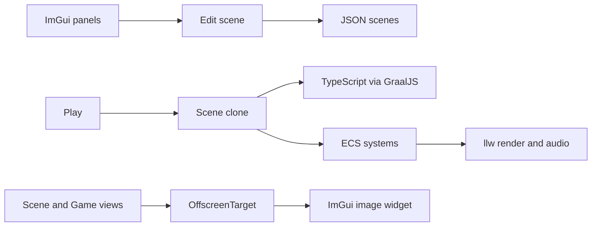

# LLW Studio


LLW Studio is a Unity-style **2D game editor** built on the [llw](/render/overview) engine. You author scenes, assets, and TypeScript scripts in a docked ImGui workspace, then press **Play** to run the same ECS and rendering stack in an isolated clone of your scene.

The editor lives in the `llw-studio` Gradle module. Shipped games use **llw** only (no ImGui).

## Architecture



- **Edit scene** — authoritative hierarchy and components while you work.
- **Play scene** — deep clone created by `PlayModeRunner`; discarded on Stop.
- **Rendering** — Scene and Game views draw through llw `OffscreenTarget` textures embedded in ImGui.

## Default layout

On first run (or **View → Reset Layout**), panels dock as follows:

| Region | Panels |
|--------|--------|
| Left | Hierarchy |
| Top center | Toolbar |
| Center | Scene and Game (tabbed) |
| Right | Inspector |
| Bottom | Animation, Project, Console |

The **Tile Palette** panel is registered but not part of the default dock — open it from the panel menu when painting tiles.

## Sample project

The repo includes `llw-studio/studio-project` as a reference game (player movement, camera, bullets, tilemap). Use it while learning:

```bash
./gradlew :llw-studio:run --args="llw-studio/studio-project"
```

## Documentation map

| Section | Topics |
|---------|--------|
| [Getting started](getting-started.md) | Install, new project, folder layout |
| [Quickstart tutorial](quickstart-tutorial.md) | Golden path with the sample project |
| Editor | [Shell](editor-shell.md), [Hierarchy](hierarchy.md), [Inspector](inspector.md), views, assets |
| Authoring | [Prefabs](prefabs.md), [Animation](animation.md), [Tilemaps](tilemaps.md), [Physics](physics-2d.md), [UI](in-game-ui.md) |
| Runtime | [Play mode](play-mode.md), [Scripting](scripting.md), [ECS](ecs-and-gameobjects.md) |
| API | [Scripting API](scripting-api/overview.md), [Components reference](components-reference.md) |

::: studio-screenshot{file="01-full-editor.png"}
Full editor with Hierarchy, Toolbar, Scene/Game tab, Inspector, Animation, Project, and Console visible.
:::
