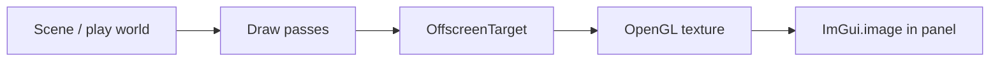

# llw engine integration

Studio embeds the **llw** module for GPU drawing, textures, audio, and resource management. The editor never ships ImGui to players—only the engine runtime.

## Render pipeline (editor views)

1. **Scene view** — edit scene + editor grid/gizmos.
2. **Game view** — play scene with game cameras and UI canvas.

Both use llw offscreen rendering, then display the color attachment inside ImGui viewports.

::: studio-screenshot{file="26-llw-render-pipeline.png"}
Annotated pipeline from world to FBO to ImGui panel.
:::

## ResourceManager

`ResourceManager` loads textures and audio clips by asset GUID during play. `PlayAudioBridge` and asset importers connect studio metadata to engine handles.

## Play bridges

| Bridge | Role |
|--------|------|
| `PlayInputBridge` | GLFW window → `Input` namespace |
| `PlayPhysicsBridge` | Box2D world ↔ `Physics2D` script API |
| `PlayAnimationBridge` | Clip sampling for `Animation2D` |
| `PlayUiInputBridge` | Mouse/keyboard for UI widgets |
| `PlayClock` | `Time.deltaTime`, `Time.time` |

Bridges clear on Stop to avoid leaking play state into edit mode.

## Dependencies

From `llw-studio/build.gradle.kts`:

- `project(":llw")` — render and audio
- **imgui-java** — editor UI only
- **GraalJS** — scripts
- **jbox2d** — physics
- **Jackson** — JSON
- **esbuild** (via Node) — TypeScript bundle

## Related

- [Render overview](/render/overview)
- [Offscreen](/render/offscreen)
- [Play mode](play-mode.md)
