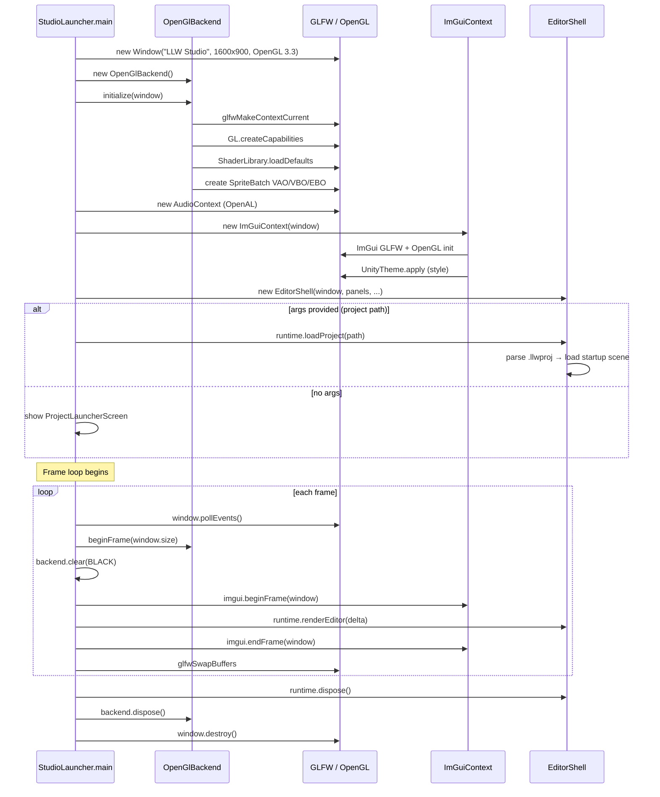
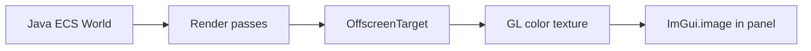
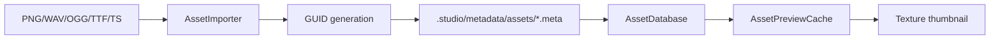
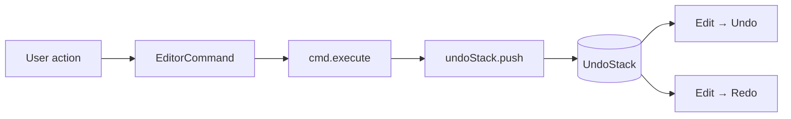

# LLW Engine Integration

Studio embeds the **llw** module for GPU drawing, textures, audio, and resource management. The editor never ships ImGui to players — only the engine runtime. This page covers the full integration: startup sequence, the editor frame loop, view rendering pipeline, tool and gizmo systems, asset import, component registration, and the undo/redo architecture.

> **Prerequisites:** Read [Engine Architecture](/architecture/engine-overview), [Render Pipeline Deep Dive](/architecture/render-pipeline), and the [Studio Overview](/studio/).

---

## 1. Startup Sequence



**Key startup details from source (`StudioLauncher.main()`):**

1. **Logging bootstrap** — `Log.init()` creates a `.llw-studio/logs/` directory with DEBUG-level output
2. **Window** — 1600×900 resizable GLFW window, OpenGL 3.3 core profile, vsync enabled by default
3. **Engine backend** — `OpenGlBackend` initialised directly (not through `GraphicsContext`, since Studio manages its own frame lifecycle)
4. **Audio** — `AudioContext` created for editor audio preview
5. **ResourceManager** — shared between engine and editor for texture/audio/font assets
6. **ImGui** — `ImGuiContext` wraps `ImGuiGLFW` + `ImGuiOpenGL3` init
7. **Theme** — `UnityTheme.apply()` sets the dark ImGui style
8. **Project** — if a path arg is provided, `StudioEditorRuntime.loadProject()` opens it immediately; otherwise the `ProjectLauncherScreen` shows

---

## 2. The Editor Frame Loop

The Studio frame loop differs from a standard game loop in that **ImGui is the primary UI** and the llw engine renders into offscreen textures that ImGui displays.

### 2.1 Frame Structure (from `StudioLauncher.main()`)

```java
while (window.isOpen()) {
    float delta = measureDeltaTime();
    window.pollEvents();
    backend.beginFrame(window.size());
    backend.setClearColor(Color.BLACK);
    backend.clear();
    
    imgui.beginFrame(window);              // ImGui new frame
    
    if (isProjectLoaded) {
        runtime.renderEditor(delta);       // EditorShell.render()
    } else {
        launcher.render();                 // Project launcher UI
    }
    
    imgui.endFrame(window);                // ImGui render
    glfwSwapBuffers(window.handle());
}
```

### 2.2 Inside `EditorShell.render()` (per frame)

```java
public void render(float deltaTime) {
    mainThreadQueue.flush();          // Execute deferred tasks (e.g. play prepare callback)
    
    if (isPlaying) {
        playModeRunner.update(playScene, deltaTime, isGameViewFocused);
        // Ticks ECS systems: input → scripts → animation → transforms → physics → audio
    }
    
    menuBar.render();                 // File, Edit, Assets, View menus
    renderDockSpace();                // ImGui dock space (full window)
    toolbar.render(context);          // Play/Stop + scene tools
    
    for (EditorPanel panel : panels) {
        panel.render(context);        // Each panel renders its ImGui content
    }
}
```

**Panel rendering order** (each panel renders its own ImGui widgets):

| Panel | Type | What it does |
|-------|------|-------------|
| `SceneViewPanel` | View | Renders edit scene into FBO, displays via `ImGui.image()`, handles viewport input |
| `GameViewPanel` | View | Renders play scene into FBO (when playing), receives keyboard/mouse focus |
| `HierarchyPanel` | Editor | Tree of `GameObject` names with drag-reparent, search, context menu |
| `InspectorPanel` | Editor | Selected entity's transform + component foldouts, or asset properties |
| `ProjectPanel` | Editor | File tree/grid of assets with drag support, thumbnails, context menu |
| `ConsolePanel` | Log | `LogSink` output with level filtering |
| `AnimationPanel` | Editor | Animation set state machine editor, clip preview |
| `TilePalettePanel` | Editor | Tile selection for tilemap painting |
| `ShaderGraphPanel` | Editor | Visual shader node editor |

### 2.3 The MainThreadQueue

`MainThreadQueue` is a critical coordination mechanism. Since some work (like script compilation) runs on a background thread, `MainThreadQueue.enqueue(Runnable)` allows thread-safe deferral of work to the main ImGui frame. It's flushed at the top of `EditorShell.render()` before any UI is drawn.

### 2.4 Key difference from game code

In a standalone game using `GraphicsContext`, you call `gfx.present()` which does `flush() → swapBuffers()`. In Studio, the engine's `OpenGlBackend` is used directly:

```
backend.beginFrame(window.size())  → sets viewport, resets GL state tracker
// ... ImGui controls drawing ...
backend clears for ImGui background
imgui.endFrame/window → ImGui renders via its own GL calls
glfwSwapBuffers → single swap at end
```

Studio never uses `GraphicsContext` — it manages the backend directly and lets ImGui handle the frame presentation.

---

## 3. View Rendering Pipeline

### 3.1 Scene View and Game View

Both views work the same way:



**Render order inside the Scene view FBO** — authoritative list in [Editor architecture](editor-architecture.md). Summary (edit mode, via `EditorSceneViewportPipeline`):

1. **Grid** (`GridDrawPass`)
2. **Tilemap paint grid** (`TilemapGridDrawPass`, when tile paint active)
3. **Tilemaps** (`TilemapDrawPass`)
4. **Sprites** (`SceneRenderPasses` — lit or unlit)
5. **Particles** (`ParticleDrawPass`)
6. **Camera / physics / component / script gizmos** (edit mode only)
7. **Selection outline** (`SelectionOutlinePass`)
8. **Transform gizmo** (`GizmoDrawPass`)

### 3.2 How FBO Textures Get to ImGui

The `OffscreenTarget`'s color attachment is a `Texture2d`. ImGui uses GL texture IDs directly:

```java
// Simplified from SceneViewPanel:
offscreen.flush();                      // Render world into FBO
int glTexId = offscreen.colorTexture().id();
ImGui.image(glTexId, viewportWidth, viewportHeight);
```

The ImGui image widget displays the FBO's color attachment as a panel image. Mouse and keyboard events on the panel are captured by ImGui and forwarded to scene tools or the play bridge.

### 3.3 Viewport Input Flow

```
Mouse click on Scene view panel →
  ImGui captures click →
  SceneViewPanel checks if panel is focused →
  If focused: convert pixel coords → SceneViewInput →
    If tool active: SceneViewInput → tool (Move/Rotate/Scale) → gizmo manipulation
    If Hand tool: SceneViewInput → editor camera pan/zoom → ScenePicker → AABB hit test
```

---

## 4. Tool and Gizmo System

### 4.1 Scene Tool Modes (`SceneToolMode`)

| Tool | Enum | Gizmo | Action on drag |
|------|------|-------|----------------|
| Hand | `HAND` | None (pan only) | Pans editor camera, click picks objects |
| Move | `MOVE` | `TranslateGizmo` | Axis arrows and center square |
| Rotate | `ROTATE` | `RotateGizmo` | Rotation ring around selection center |
| Scale | `SCALE` | `ScaleGizmo` | Axis handles + uniform corner handle |
| Paint | `PAINT` | None | Paints tiles on selected tilemap |
| Erase | `ERASE` | None | Erases tiles from tilemap layers |

### 4.2 Gizmo Architecture

Each gizmo (`TranslateGizmo`, `RotateGizmo`, `ScaleGizmo`) implements hit-testing and dragging:

```
GizmoController.update() →
  GizmoHit test = gizmo.hitTest(mouseWorld, camera) →
  if hit: start drag, record TransformSnapshot for undo →
  on mouse release: push TransformEditCommand to undo stack
```

### 4.3 Editor Camera

The `EditorCamera` is separate from the game's `Camera2d`:

- Panned with middle-mouse drag
- Zoomed with scroll wheel
- `Camera2d` behind the scenes with custom `EditorViewportMath` for pan/zoom

---

## 5. Asset Import Pipeline

When a file is dropped into the Project panel or placed in `Assets/`:



1. **File detection** — file watcher or explicit Refresh scans `Assets/` folder
2. **GUID** — each asset gets a stable GUID stored in `.studio/metadata/assets/`
3. **Importer** — per-type importer runs (texture mip gen, audio decode, font atlas build)
4. **Preview** — `AssetPreviewCache` rasterises thumbnails for the grid view
5. **Registration** — `AssetDatabase` indexes by path and GUID

### 5.1 Texture Slicing

Sprite sheets are sliced in the Inspector's `SpritesheetSliceModal`:

1. Select texture → Inspector → **Slice Editor…**
2. Set cell size, offset, padding
3. Slices are stored as virtual sub-assets in the metadata
4. Each slice has its own GUID and UV rect

### 5.2 Asset Reference Fields

Inspector fields that reference assets (sprite, animation clip, prefab) use drag-and-drop:

```
Drag from Project panel → drops on Inspector field →
  payload carries ASSET_GUID →
  field resolves GUID via AssetDatabase →
  displays sprite thumbnail / clip name / entity name
```

---

## 6. Component System

### 6.1 ComponentCatalog

`ComponentCatalog` is the registry of all addable component types. Each entry carries:

- Component class
- Display name ("Sprite Renderer", "Rigidbody 2D", etc.)
- Default factory
- Icon

### 6.2 Component Drawers

Each component has an inspector drawer (`*Drawer.java` in `inspector/builtin/`) that renders the component's fields in the Inspector panel:

| Drawer | Component |
|--------|-----------|
| `TransformDrawer` | Transform 2D (position, rotation, scale) |
| `SpriteRendererDrawer` | Sprite Renderer (sprite GUID, color, sorting order) |
| `ScriptDrawer` | Script (class selector, serialized fields) |
| `Rigidbody2DDrawer` | Rigidbody 2D (body type, mass, gravity scale) |
| ... | 15 more built-in drawers |

### 6.3 Adding a New Component Type

To add a new component:

1. Define the component data class (e.g. `MyComponent.java`)
2. Register it in `ComponentCatalog`
3. Write a `ComponentDrawer` for the Inspector
4. Register a serializer in `ComponentSerializerRegistry`
5. Add it to the scripting API bridge (if scripts need access)

---

## 7. Undo/Redo Architecture

### 7.1 Command Stack (`UndoStack`)



### 7.2 Built-in Commands

| Command | What it records |
|---------|----------------|
| `TransformEditCommand` | Gizmo drag final position (records `TransformSnapshot` before/after) |
| `AddComponentCommand` | Component addition with all default fields |
| `TilemapPaintCommand` | Tile placement/erasure within a brush region |
| `AnimationClipEditCommand` | Clip keyframe edits |

### 7.3 Undo Snapshots

`TransformSnapshot` captures position, rotation, and scale before a gizmo drag. On mouse release:

```java
// During gizmo drag start:
TransformSnapshot before = new TransformSnapshot(entity.transform);

// On mouse release:
TransformSnapshot after = new TransformSnapshot(entity.transform);
undoStack.push(new TransformEditCommand(entity, before, after));
```

---

## 8. Play Mode Bridges

When play mode is active, several bridges connect the llw engine state to the script runtime:

| Bridge | Role | Source |
|--------|------|--------|
| `PlayInputBridge` | GLFW keyboard/mouse → `Input` namespace | `PlayInputSystem` polls each frame |
| `PlayPhysicsBridge` | Box2D world → script `Physics2D` API | Proxy methods on `PhysicsWorld` |
| `PlayAnimationBridge` | Clip GUID → keyframe sampling | `AnimationSystem` updates sprite frames |
| `PlayUiInputBridge` | ImGui want-capture → game UI input | Prevents game input when ImGui is active |
| `PlayAudioBridge` | Audio clip GUID → `AudioSource` play/stop | Routes through `ResourceManager` |
| `PlayClock` | Frame delta → `Time.deltaTime`, `Time.time` | Updated each play tick |

All bridges clear on Stop to prevent play state leaking into edit mode.

---

## 9. Full Frame Trace (Debug)

Here's what happens in one editor frame with a loaded project:

| Order | Component | Action |
|-------|-----------|--------|
| 1 | `StudioLauncher` | `window.pollEvents()` |
| 2 | `OpenGlBackend` | `beginFrame(window.size)` — glViewport, reset state tracker |
| 3 | `OpenGlBackend` | `clear(BLACK)` — clear framebuffer for ImGui background |
| 4 | `ImGuiContext` | `beginFrame(window)` — ImGui new frame |
| 5 | `EditorShell` | `mainThreadQueue.flush()` |
| 6 | `EditorShell` | If playing: `playModeRunner.update(playScene, delta, focused)` |
| 7 | `PlayModeRunner` | Tick ECS systems: Input → Scripts → Animation → Transforms → Physics → Audio |
| 8 | `EditorShell` | `menuBar.render()` |
| 9 | `EditorShell` | `renderDockSpace()` — ImGui full-window dock space |
| 10 | `EditorShell` | `toolbar.render()` |
| 11 | `SceneViewPanel` | `offscreen.clear` → render edit scene + grid + gizmos → `offscreen.flush()` → `ImGui.image(fboTex)` |
| 12 | `GameViewPanel` | If playing: same pipeline for play scene → `ImGui.image(fboTex)` |
| 13 | `HierarchyPanel` | Game object tree |
| 14 | `InspectorPanel` | Selected entity's components with editable fields |
| 15 | `ProjectPanel` | Asset tree/grid |
| 16 | Other panels | Console, Animation, Tile Palette, Shader Graph |
| 17 | `ImGuiContext` | `endFrame(window)` — ImGui renders GL draw calls |
| 18 | `StudioLauncher` | `glfwSwapBuffers` — present to screen |

## Related

- [Play Mode](/studio/play-mode)
- [ECS and GameObjects](/studio/ecs-and-gameobjects)
- [Scenes and Serialization](/studio/scenes-and-serialization)
- [Render Overview](/render/overview)
- [Offscreen](/render/offscreen)
