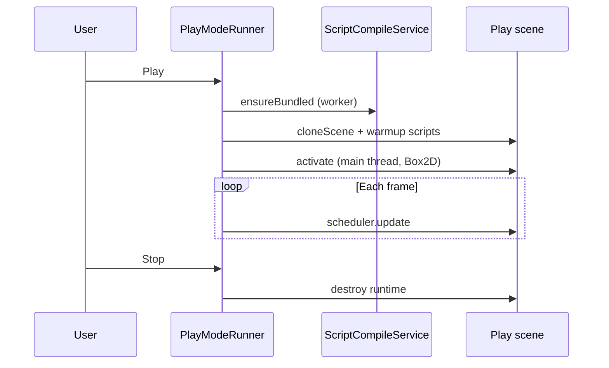

# Play mode

Press **Play** on the toolbar to bundle scripts, **clone** the edit scene, and tick ECS systems each frame. **Stop** destroys the play world and GraalJS runtime.

## Lifecycle

### Prepare (may run off main thread)

1. Collect script GUIDs referenced by the scene.
2. **esbuild** bundles TypeScript to `.studio/metadata/script-cache/`.
3. Deep-clone entities and components into a new `Scene`.
4. Create `GraalScriptRuntime` and warm up script factories/instances.

### Activate (main thread)

1. Build `PhysicsWorld` from colliders and rigidbodies.
2. Register play systems on `SystemGroup.LOGIC` (order below).
3. Enable input/audio bridges.

### Stop

Destroys script instances, closes Graal, tears down Box2D, clears bridges.

::: studio-screenshot{file="21-play-mode-banner.png"}
Editor during play with Stop on toolbar.
:::

::: studio-screenshot{file="11-game-view.png"}
Game view showing play output.
:::

## System tick order (logic group)

Each frame, `PlayModeRunner.update` runs (when Game view focused for input):

1. `PlayInputSystem`
2. `UiInputSystem`
3. `JsScriptSystem` — `start`, `update`, `fixedUpdate`, physics callbacks
4. `AnimationSystem` — samples clips, updates sprites
5. `TransformSystem` — world matrix propagation
6. `PhysicsSystem` — Box2D step, sync transforms
7. `AudioSystem` — play/stop audio sources

Rendering for Game view uses the play scene’s render passes separately from this scheduler.

## What is frozen in the editor

While playing:

- Edit scene hierarchy and Inspector edits to the edit scene do not affect play (unless you stop and change edit data).
- Scene view gizmos are hidden; Scene view still shows the **edit** scene.
- Script file watcher defers hot reload until Stop.

## Input

`PlayInputBridge` passes GLFW input only when the **Game** view is focused. Click inside Game before testing controls.

## Related

- [Systems reference](systems-reference.md)
- [Scripting](scripting.md)
- [Game view](game-view.md)
