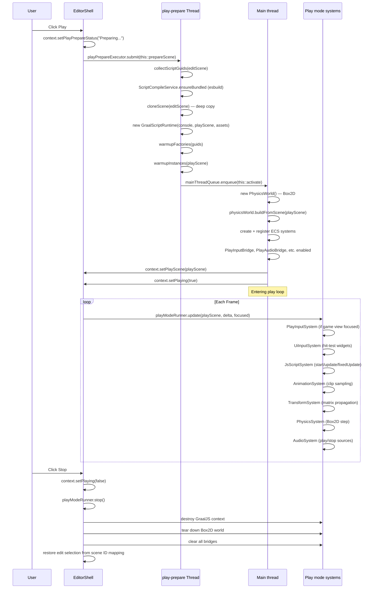

# Play Mode

Press **Play** on the toolbar to bundle scripts, **clone** the edit scene, and tick ECS systems each frame. **Stop** destroys the play world and GraalJS runtime. This page covers the full lifecycle, scene cloning, play bridges, GraalJS integration, error recovery, and system scheduling.

> **Prerequisites:** [ECS and GameObjects](/studio/ecs-and-gameobjects), [llw engine integration](/studio/llw-engine-integration)

---

## 1. Full Lifecycle



---

## 2. Prepare Phase (Background Thread)

The prepare phase runs on a dedicated `play-prepare` thread so the editor UI remains responsive during bundling. It consists of four steps:

### 2.1 Script GUID Collection

```java
Set<String> sceneScriptGuids = ScriptSceneIndex.collectGuids(editScene);
```

`ScriptSceneIndex` walks all entities in the edit scene and collects GUIDs from `ScriptComponent` attachments. Only scripts referenced by the current scene are bundled — not the entire project.

### 2.2 TypeScript Bundling

```java
ScriptCompileService.ensureBundled(projectRoot, assets, sceneScriptGuids, console);
```

- Locates `.ts` source files under `Assets/Scripts/`
- Runs **esbuild** to bundle each script (or a shared bundle) into JavaScript
- Output goes to `.studio/metadata/script-cache/{guid}.js`
- Schema extraction runs alongside to produce `.studio/metadata/script-schemas/{guid}.json`
- Compile errors are routed to the Console panel

### 2.3 Scene Cloning

```java
Scene playScene = cloneScene(editScene);
```

The clone is a **deep copy**:

1. All entities are created in a new World with new integer IDs
2. All component data is copied field-by-field (not reference-shared)
3. `SceneObjectIdComponent` preserves the mapping between edit-ID and play-ID for bridge lookups
4. The hierarchy tree (parent/child) is rebuilt from `HierarchyComponent`

**What is shared (not cloned):**

- `Texture2d` GPU handles (textures are read-only during play)
- `SoundBuffer` audio handles
- `Font` atlas textures
- Asset GUID references (resolved at runtime through `ResourceManager`)

### 2.4 GraalJS Warmup

```java
GraalScriptRuntime preparedRuntime = new GraalScriptRuntime(console, playScene, assets, projectRoot);
JsScriptSystem preparedScriptSystem = new JsScriptSystem(preparedRuntime, assets, projectRoot, console);
preparedScriptSystem.warmupFactories(sceneScriptGuids);
preparedScriptSystem.warmupInstances(playScene);
```

- `GraalScriptRuntime` creates a new GraalJS `Context` with `ScriptHostApi` bindings
- `warmupFactories` compiles the bundled JS into executable script factory objects
- `warmupInstances` calls `new ScriptClass()` for each entity with a Script attachment
- Script `start()` is deferred until the first frame after activation

---

## 3. Activation Phase (Main Thread)

### 3.1 Physics World Construction

```java
physicsWorld = new PhysicsWorld();
physicsWorld.buildFromScene(playScene.world());
```

`buildFromScene` iterates all entities with:
- **Rigidbody2DComponent** → creates Box2D body (static, kinematic, dynamic)
- **BoxCollider2DComponent / CircleCollider2DComponent / EdgeCollider2DComponent** → creates Box2D fixtures
- **`isTrigger` flag** → marks fixture as sensor (trigger callbacks only, no collision response)

### 3.2 System Registration

Play systems are registered in strict order on `SystemGroup.LOGIC`:

| Order | System | Responsibility | Requires |
|-------|--------|----------------|----------|
| 1 | `PlayInputSystem` | GLFW → script `Input` when Game view focused | `windowHandle`, `PlayInputBridge` |
| 2 | `UiInputSystem` | Hit-test UI widgets, focus text fields | `PlayUiInputBridge` |
| 3 | `JsScriptSystem` | `start()` / `update()` / `fixedUpdate()`, physics callbacks | `GraalScriptRuntime` |
| 4 | `AnimationSystem` | Sample animation clips, update sprite frames | `PlayAnimationBridge` |
| 5 | `TransformSystem` | Propagate local transforms to world space | Hierarchy traversal |
| 6 | `PhysicsSystem` | Box2D step, sync rigidbody transforms | `PhysicsWorld`, `PhysicsContactBridge` |
| 7 | `AudioSystem` | Play/stop `AudioSource` components | `PlayAudioBridge` |

### 3.3 Bridge Activation

| Bridge | Activated in | What it wires |
|--------|-------------|---------------|
| `PlayInputBridge` | `PlayInputSystem.init` | GLFW window handle → `Input.isKeyDown()` etc. |
| `PlayAudioBridge` | activate | Asset GUID → `ResourceManager` → OpenAL source play/stop |
| `PlayAnimationBridge` | activate | Clip GUID → keyframe interpolation → sprite rect |
| `PlayUiInputBridge` | activate | ImGui want-capture → UI input routing |
| `PlayClock` | `PlayModeRunner.update` | Delta time → `Time.deltaTime`, `Time.time`, `Time.frameCount` |

---

## 4. Per-Frame Tick

```java
public void update(Scene playScene, float deltaTime, boolean gameViewFocused) {
    // 1. Input system — only if Game view is focused
    if (gameViewFocused) {
        playInputSystem.update(windowHandle, deltaTime);
    }
    
    // 2. UI input system
    uiInputSystem.update(playScene, deltaTime);
    
    // 3. Script system
    scriptSystem.update(deltaTime);
    
    // 4. Animation system
    animationSystem.update(playScene, deltaTime);
    
    // 5. Transform system
    transformSystem.update(playScene);
    
    // 6. Physics system
    physicsSystem.update(deltaTime);
    
    // 7. Audio system
    audioSystem.update(playScene);
}
```

### 4.1 Fixed Timestep for Physics

`PhysicsSystem` uses a fixed timestep accumulator (default: 1/60s):

```
accumulator += deltaTime
while (accumulator >= fixedDt) {
    physicsWorld.step(fixedDt)
    accumulator -= fixedDt
}
```

This ensures deterministic physics regardless of frame rate fluctuations.

### 4.2 Script Lifecycle Callbacks in the Tick

`JsScriptSystem` dispatches per frame:

| Callback | When | Phase |
|----------|------|-------|
| `start()` | First frame after instance creation | Before first `update()` |
| `update()` | Each frame | Main game logic |
| `fixedUpdate()` | Each physics step (multiple per frame possible) | Forces that must sync with Box2D |
| `onCollisionEnter2D` / `Stay` / `Exit` | After physics step | `PhysicsContactBridge` dispatches |
| `onTriggerEnter2D` / `Stay` / `Exit` | After physics step | Trigger-only contacts |
| `onEnable()` / `onDisable()` | Active state toggled | Resource acquisition / cleanup |
| `onDestroy()` | Entity destroyed or play stopped | Cleanup timers, event listeners |

---

## 5. Stop Phase

When the user clicks Stop:

```java
context.setPlaying(false);
playModeRunner.stop();  // Destroy GraalJS context + Box2D world
session.setPlayScriptSystem(null);
selection.clear();
// Restore edit selection by mapping play entity ID → edit entity ID via SceneObjectIdComponent
```

**What is destroyed:**
- `GraalScriptRuntime` — GraalJS `Context.close()`
- `JsScriptSystem` — all script instances
- `PhysicsWorld` — Box2D world delete
- All bridges — input, audio, animation, physics, clock

**What is preserved:**
- Edit scene (unchanged — play-time edits are discarded)
- Undo stack (play mode does not touch it)
- Asset metadata (GUIDs remain valid)

---

## 6. Edit vs Play Isolation

| Aspect | Edit mode | Play mode |
|--------|-----------|-----------|
| Scene | `context.editScene()` — authoritative | `context.playScene()` — deep clone |
| Systems | None (editor rendering only) | 7 ECS systems |
| Physics | Not simulated | Box2D stepping |
| Scripts | Not loaded | GraalJS execution |
| Gizmos | Visible | Hidden |
| Game view | "Press Play" placeholder | Live render of play scene |
| Input | ImGui captures all (menus, panels) | Routed to game only when Game view focused |
| Undo | Active | Frozen (no undo in play) |
| File watcher | Active | Deferred until Stop |

---

## 7. Error Recovery

### 7.1 esbuild Bundle Failure

If TypeScript compilation fails:
- Error messages appear in the Console panel with file/line numbers
- `context.setPlayPrepareStatus()` is updated with the error
- Play mode does not enter — the edit scene is left intact

### 7.2 GraalJS Runtime Exception

If a script throws during play:
- The exception is caught by `JsScriptSystem`
- Stack trace goes to the Console panel
- The offending entity's script is disabled (others continue running)

### 7.3 Box2D Explosion

If physics creates invalid contacts (e.g. NaN velocities):
- `PhysicsSystem` clamps delta time to `0.05f` max
- Entities with NaN positions have their transforms reset to origin

## Related

- [llw engine integration](/studio/llw-engine-integration)
- [ECS and GameObjects](/studio/ecs-and-gameobjects)
- [Scenes and Serialization](/studio/scenes-and-serialization)
- [Systems Reference](/studio/systems-reference)
- [Scripting](/studio/scripting)
