# Scenes and Serialization

Scenes are **JSON** files under `Scenes/`, typically `*.scene.json`. The project manifest (`*.llwproj`) stores which scene loads at startup. This page covers the full serialization architecture — the JSON schema, serializer pipeline, version migration, prefab instances, and GUID resolution.

> **Prerequisites:** [ECS and GameObjects](/studio/ecs-and-gameobjects)

---

## 1. Full JSON Schema

```json
{
  "version": 2,
  "name": "Main",
  "objects": [
    {
      "id": 1,
      "name": "Player",
      "tag": "",
      "active": true,
      "parentId": -1,
      "transform": {
        "x": 0.0,
        "y": 0.0,
        "rotation": 0.0,
        "scaleX": 1.0,
        "scaleY": 1.0
      },
      "components": {
        "SpriteRenderer": {
          "spriteGuid": "abc123...",
          "color": { "r": 255, "g": 255, "b": 255, "a": 255 },
          "sortingOrder": 0
        },
        "Script": {
          "scriptGuid": "def456...",
          "serializedFields": {
            "moveSpeed": 0,
            "acceleration": 80,
            "rotationSpeed": 120
          }
        },
        "BoxCollider2D": {
          "size": { "x": 64.0, "y": 64.0 },
          "offset": { "x": 0.0, "y": 0.0 },
          "isTrigger": false
        }
      },
      "prefabGuid": "",
      "prefabOverrides": {}
    }
  ]
}
```

### 1.1 Root Fields

| Field | Type | Required | Description |
|-------|------|----------|-------------|
| `version` | integer | Yes | Serializer format version; Studio migrates older versions on load |
| `name` | string | Yes | Scene display name |
| `objects` | array | Yes | Root-level array of serialized game objects |

### 1.2 Object Fields

| Field | Type | Required | Description |
|-------|------|----------|-------------|
| `id` | integer | Yes | Stable scene object ID (never reused, allocated by `SceneObjectIds`) |
| `name` | string | No | Display name in Hierarchy |
| `tag` | string | No | Tag for filtering (e.g. "Player", "Enemy") |
| `active` | boolean | No | Initial active state (default: `true`) |
| `parentId` | integer | No | `id` of this object's parent, or `-1` for root objects |
| `transform` | object | Yes | Always present — `x`, `y`, `rotation` (degrees), `scaleX`, `scaleY` |
| `components` | object | No | Map of component type name → serialized fields |
| `prefabGuid` | string | No | If non-empty, this object is a prefab instance |
| `prefabOverrides` | object | No | Field diffs from the base prefab data |

---

## 2. Serializer Architecture

```mermaid
flowchart LR
    A[SceneSerializer.save scene, path] --> B[build JSON root with version + name]
    B --> C[allocate IDs for new entities]
    C --> D[for each entity]
    D --> E[writeObject scene, entity, id, parentId]
    E --> F[write transform fields]
    F --> G[for each component]
    G --> H[ComponentSerializerRegistry.write]
    H --> I[Jackson write to file]
```



### 2.1 Serializer Stack

| Layer | Class | Responsibility |
|-------|-------|----------------|
| Entry point | `SceneSerializer` | Iterates entities, builds JSON array, writes file |
| Per-object | `SceneObjectSerializer` | Writes one entity's transform, components, prefab data |
| Per-component | `ComponentSerializerRegistry` | Maps `Class<?>` → writer function, `String` → reader function |
| Per-type | Registered lambdas | Serializes specific component fields to/from `ObjectNode` |

### 2.2 ComponentSerializerRegistry

```java
public final class ComponentSerializerRegistry {
    private final Map<Class<?>, BiConsumer<ObjectNode, Object>> writers;
    private final Map<String, BiConsumer<GameObject, ObjectNode>> readers;
    
    public <T> void register(
        Class<T> type,
        String jsonKey,
        BiConsumer<ObjectNode, T> writer,
        Function<ObjectNode, T> reader,
        BiConsumer<GameObject, T> applier
    );
}
```

Each component type registers:
- A **writer** that populates a JSON node from the component instance
- A **reader** that constructs a component instance from a JSON node
- An **applier** that attaches the component to a `GameObject`

### 2.3 Registration Example (SpriteRenderer)

```java
serializerRegistry.register(
    SpriteRendererComponent.class,
    "SpriteRenderer",
    (node, comp) -> {
        node.put("spriteGuid", comp.spriteGuid);
        // ... color, sortingOrder
    },
    (node) -> {
        SpriteRendererComponent comp = new SpriteRendererComponent();
        comp.spriteGuid = node.get("spriteGuid").asText();
        // ...
        return comp;
    },
    (object, comp) -> object.addComponent(comp)
);
```

---

## 3. Loading and Saving

### 3.1 Save Flow

1. **File → Save Scene** — calls `SceneSerializer.save(editScene, scenePath)`
2. `save()` iterates all entities (skipping "Scene Root")
3. Allocates scene IDs for any entity that doesn't have one
4. Builds a `Map<EntityId, Integer>` for parent lookups
5. For each entity, `SceneObjectSerializer.writeObject()` serializes transform + all registered components
6. Jackson writes the result with `PrettyPrinter` formatting

### 3.2 Load Flow

1. **Double-click** a `*.scene.json` in Project panel
2. `SceneSerializer.load(path)` reads the JSON
3. Version check — if `version < 2`, migration steps are applied
4. For each object in the `objects` array:
   - Create entity → allocate `SceneObjectIdComponent` with the stored `id`
   - Restore parent/child via `HierarchyComponent` (batch link after all entities created)
   - For each component entry, call `ComponentSerializerRegistry.read()`
   - If `prefabGuid` is set, apply overrides over base prefab data
5. Ensure at least one `Camera2DComponent` exists (create default if not)

### 3.3 Project Save

**File → Save Project** writes the `*.llwproj` manifest:

```json
{
  "name": "My Game",
  "startupScene": "Scenes/Main.scene.json"
}
```

---

## 4. Version Migration

When a scene is loaded with a lower `version` than the current serializer, migration runs:

```java
if (sceneVersion < VERSION) {
    migrate(root, sceneVersion);
}
```

### Migration Steps

| From version | To version | Migration |
|-------------|-----------|-----------|
| 1 | 2 | Convert old `position` object format to new `transform` format. Add `SceneObjectIdComponent` with auto-incrementing IDs for entities that lack them. |

Migrations are applied in sequence (1→2, then 2→3, etc.). Each migration function receives the `ObjectNode` root and mutates it in place before the result is deserialized into `Scene` objects.

---

## 5. Prefab Instances

### 5.1 Serialization Format

Prefab instances store a link to the original prefab asset plus overrides:

```json
{
  "id": 42,
  "name": "Enemy (1)",
  "prefabGuid": "assets/prefabs/Enemy.prefab.json",
  "prefabOverrides": {
      "transform": { "x": 100.0 },
      "components": {
          "Script": { "moveSpeed": 50 }
      }
  },
  // ... transform and components follow the same schema as regular objects
}
```

### 5.2 How Overrides Work

When loading:
1. Deserialize the base prefab from the asset (if not already cached)
2. Start with all base prefab data
3. Apply overrides on top (field-level merge)
4. Instance-specific additions (new components, child objects) are merged alongside overrides

### 5.3 Runtime Instantiation

`PrefabInstantiator.deserializePrefab()` is called from:
- Editor: when dragging a prefab into the Hierarchy
- Play mode: when `Scene.createEntity(name, prefabPath)` is called from TypeScript

---

## 6. GUID Resolution

### 6.1 How GUIDs Work

Scenes, prefabs, and components reference assets by **GUID**, not file path:

```
In scene JSON:    "spriteGuid": "a1b2c3d4-..."
On filesystem:    Assets/player.png
In metadata:      .studio/metadata/assets/a1b2c3d4-....meta
```

### 6.2 Resolution at Runtime

1. Scene JSON contains GUID strings
2. On load, `AssetDatabase` resolves GUID → file path → `AssetHandle`
3. `ResourceManager` loads the actual GPU resource (texture, sound buffer, font)
4. The resolved resource is assigned to the component (e.g. `SpriteRendererComponent.spriteGuid` is kept as GUID string; the `Texture2d` is resolved at draw time)

### 6.3 GUID Stability

When renaming or moving files:
- The `.meta` file moves with the asset (if both are together)
- The GUID inside the `.meta` file stays the same
- All scene/prefab references remain valid

When copying a project:
- Always include **both** `Assets/` and `.studio/metadata/assets/`
- Without metadata, scenes will have broken GUID references

---

## 7. Tilemap and UI Serialization

### 7.1 TilemapComponent JSON Format

```json
{
  "Tilemap": {
    "tilesetTextureGuid": "abc...",
    "layers": [
      {
        "name": "Ground",
        "tiles": {
          "0,0": "sprite-guid-1",
          "0,1": "sprite-guid-2",
          "1,0": "sprite-guid-3"
        },
        "cellSize": 32
      }
    ]
  }
}
```

Tile positions use `"col,row"` string keys for sparse storage (empty cells are omitted).

### 7.2 UI Canvas Components

UI components (Canvas, Label, Button, Toggle, Text Field) serialize their layout fields:

```json
{
  "UIButton": {
    "text": "Start",
    "fontSize": 24,
    "interactable": true
  }
}
```

All UI widget positions are driven by their `Transform2DComponent` (pixel offsets from canvas origin).

---

## 8. Serialization Tests

The project includes round-trip serialization tests:

| Test | What it verifies |
|------|-----------------|
| `TilemapSerializationTest` | Tilemap component JSON output matches expected shape |
| `UiSerializationTest` | UI component JSON output matches expected shape |
| `SceneSerializationTest` | Full scene save → load → compare entity count |

These tests define the expected JSON shapes and catch regressions when new fields are added to components.

## Related

- [ECS and GameObjects](/studio/ecs-and-gameobjects)
- [Project Format](/studio/project-format)
- [Prefabs](/studio/prefabs)
- [Components Reference](/studio/components-reference)
